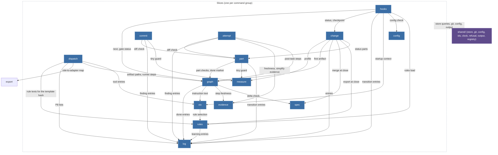
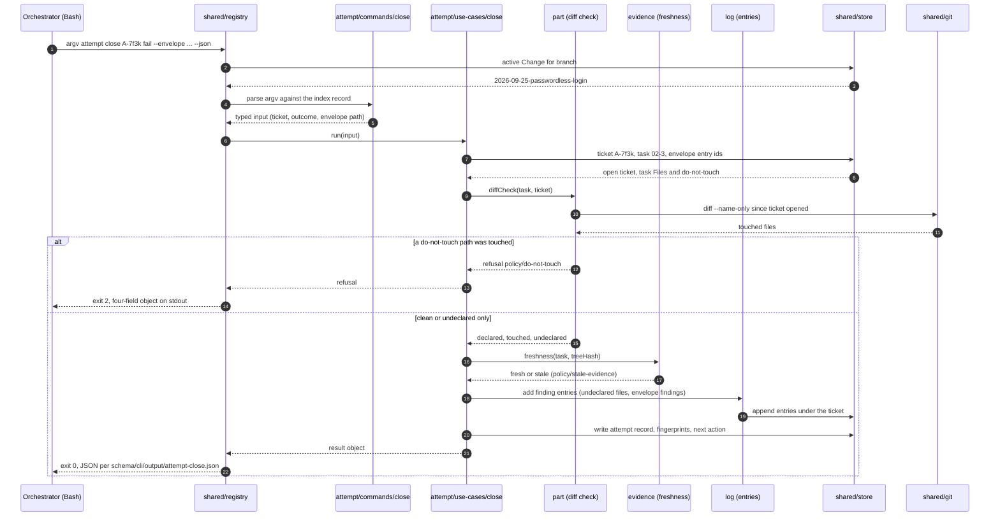

# kernel-architecture Specification

## Purpose

The kernel source is organised by capability, not by technical layer (design decision D-13 of the archived Change `v3-t10-kernel-cli-contract`). One **slice** per command group of `kernel-cli` owns its whole vertical: parsing argv into a typed input, the use case, its writes on the Change directory built on the shared store, text and JSON rendering, the zod output schema of each command, and its tests next to the code. A file under `schema/cli/` is generated from that zod by `pnpm build` when the zod exists and stays hand-written otherwise (design decision D-10 of the archived Change `v3-t12-layered-config`). `shared/` holds only what is an OS boundary or is used by three or more slices. Every record in `schema/cli/commands.json` names its `slice`; the contract test checks that the set of slices in the index equals the module list of this spec and that the dependency matrix names only known slices. T11's import scan checks the code against the same matrix.

The alternatives (horizontal layers, hexagonal) and why they lost are recorded in design decision D-13 of the archived Change `v3-t10-kernel-cli-contract`.

## Requirements

### Requirement: Vertical slices

The kernel source SHALL be organised as one slice per command group plus `shared/`; the set of `slice` values in `schema/cli/commands.json` SHALL equal this module list.

| Slice      | Commands                                                                                                                                     | Owner tasks   | One sentence                                                                                                                                                                                                                    |
| ---------- | -------------------------------------------------------------------------------------------------------------------------------------------- | ------------- | ------------------------------------------------------------------------------------------------------------------------------------------------------------------------------------------------------------------------------- |
| `change`   | `change new`, `status`, `list`, `resume`, `park`, `takeover`, `checkpoint`, `close`                                                          | T20, T22, T30 | Lifecycle of the one Change per branch; `close` merges the spec deltas through `spec` and archives.                                                                                                                             |
| `measure`  | `measure`                                                                                                                                    | T20           | Size heuristic for an intent or a diff; separate because `change new` and `/bdk:cr` both call it and its calibration changes independently.                                                                                     |
| `graph`    | `next`, `explain`, `validate`, `done`                                                                                                        | T21           | The artifact graph from `pipeline.yaml`: node states, input hashes, kind validators, gate status.                                                                                                                               |
| `part`     | `part list`, `start`, `done`, `split`                                                                                                        | T22           | Plan parts, their validators (S1, P6) and the diff check against `Files:` and `do-not-touch`.                                                                                                                                   |
| `attempt`  | `attempt open`, `close`, `list`                                                                                                              | T22           | Tickets, budgets, the escalation ladder and oscillation detection (P4, A-drabina).                                                                                                                                              |
| `log`      | `log add`, `ingest`, `list`, `show`, `resolve`                                                                                               | T20, T22, T31 | The append-only ledger and its provenance rules (K2, P1); the leaf every writing slice depends on.                                                                                                                              |
| `dispatch` | `dispatch build`, `show`                                                                                                                     | T23           | Dispatch packages (K3, K4).                                                                                                                                                                                                     |     |
| `evidence` | `evidence record`, `check`                                                                                                                   | T23           | Evidence manifests, tree hashes, citations and freshness (T4, P5).                                                                                                                                                              |
| `spec`     | `spec delta check`, `merge`, `diff`                                                                                                          | T30           | Spec deltas and the deterministic merge (D2b, V1-7).                                                                                                                                                                            |
| `config`   | `config show`, `check`, `schema`, `set`                                                                                                      | T12           | The commands over the layered configuration; the layering itself is `shared/config`.                                                                                                                                            |
| `ctx`      | `ctx skill`, `startup`, `craft`                                                                                                              | T13, T42      | Prompt context composition: the skill manifest, rules, fragments, tool entries, the agents table, and the installed `bdk-craft` skills.                                                                                         |
| `rules`    | `rules check`, `show`, `accept`, `explain`, `prune`, `import`, `stats`, `export`                                                             | T23, T31      | Rule files of the bundle and the project, their ids, `applies` selection per package, the audit view and adoption by `rules accept`; the rule texts `ctx` and `dispatch` read.                                                  |
| `query`    | `query`                                                                                                                                      | T20           | Read-only SQL over the index.                                                                                                                                                                                                   |
| `commit`   | `commit`                                                                                                                                     | T22           | The task commit with BDK trailers.                                                                                                                                                                                              |
| `review`   | `review plan`                                                                                                                                | T42           | The range and the reviewer groups of a review round, from the plan parts, the ledger and git.                                                                                                                                   |
| `hooks`    | `hooks session-start`, `session-end`, `prompt-expansion`, `pre-tool`, `post-tool`, `subagent-start`, `subagent-stop`, `stop`, `skill-exists` | T13, T24, T41 | Host payload parsing, guard decisions, the only writer of `source: user`.                                                                                                                                                       |
| `service`  | `doctor`, `rebuild`, `version`                                                                                                               | T11, T22      | Diagnosis, index rebuild and the version; reads every other slice; `rebuild` writes Change state only through the `shared/store` rebuild core, which `change takeover` shares, and settles part worktrees through `part` (T45). |
| `export`   | `export agents`                                                                                                                              | T23           | Host projections: the adapter files generated from the adapter definitions and the per-host tool map.                                                                                                                           |     |
| `agents`   | `agents list`, `show`, `wait`                                                                                                                | T41           | The agent registry (T41-D6): its database, the derived states, the delivery cursor and the queries the agent hooks and the guard use.                                                                                           |     |

The one relationship the map shows is _who may import whom_. Arrows point from the importing slice to the imported one; every slice may import `shared/`, drawn as one edge from the slice boundary. `service` (imports every slice, read-only), `query`, `export` and `agents` (import nothing but `shared/`; `hooks` imports `agents`) are left out of the drawing to stay within the node budget; the matrix below is complete.


```mermaid
flowchart TB
    subgraph Slices["Slices (one per command group)"]
        hooks["hooks"]
        change["change"]
        dispatch["dispatch"]
        commit["commit"]
        attempt["attempt"]
        part["part"]
        graphSlice["graph"]
        ctx["ctx"]
        rules["rules"]
        log["log"]
        evidence["evidence"]
        spec["spec"]
        measure["measure"]
        config["config"]
    end
    shared["shared/ (store, git, config, ids, clock, refusal, output, registry)"]

    hooks -->|"next, gate status"| graphSlice
    hooks -->|"status, checkpoint"| change
    hooks -->|"transition entries"| log
    hooks -->|"startup context"| ctx
    hooks -->|"config check"| config
    hooks -->|"rules load"| rules
    change -->|"profile"| measure
    change -->|"first artifact"| graphSlice
    change -->|"entries"| log
    change -->|"merge at close"| spec
    change -->|"export at close"| rules
    change -->|"status parts"| part
    graphSlice -->|"done entries"| log
    graphSlice -->|"instruction text"| ctx
    part -->|"part checks, done marker"| graphSlice
    part -->|"tiny guard"| measure
    part -->|"transition entries"| log
    attempt -->|"diff check"| part
    attempt -->|"finding entries"| log
    attempt -->|"freshness, simplify evidence"| evidence
    attempt -->|"post-task steps"| graphSlice
    graphSlice -->|"step freshness"| evidence
    graphSlice -->|"delta check"| spec
    commit -->|"diff check"| part
    commit -->|"finding entries"| log
    commit -->|"tiny guard"| measure
    dispatch -->|"rule texts for the template hash"| rules
    dispatch -->|"P8 lists"| log
    dispatch -->|"role-to-adapter map"| export
    dispatch -->|"artifact paths, runner steps"| graphSlice
    dispatch -->|"tool entries"| ctx
    ctx -->|"rule selection"| rules
    rules -->|"learning entries"| log
    Slices -->|"store queries, git, config, output"| shared

    classDef primary fill:#3b6ea5,stroke:#7fa8d0,color:#ffffff
    classDef store fill:#5f4b8b,stroke:#9b8bc4,color:#ffffff
    class hooks,change,dispatch,commit,attempt,part,graphSlice,ctx,rules,log,evidence,spec,measure,config primary
    class shared store
    style Slices fill:transparent,stroke:#8b93a1,stroke-dasharray:4 3
```

#### Scenario: slice parity

- **WHEN** a record in `schema/cli/commands.json` names a slice that this list does not contain, or a listed slice has no record
- **THEN** the contract test fails

#### Scenario: T22 slices registered

- **WHEN** the kernel's registrations are listed after T22
- **THEN** the `attempt`, `part` and `commit` slices register handlers for every record whose slice they are, and none answers `kernel/not-implemented`

#### Scenario: T23 part B slices registered

- **WHEN** the kernel's registrations are listed after T23 part B
- **THEN** `dispatch build`, `dispatch show`, `log ingest` and `rules show` have handlers, and of the `rules` records only the other verbs and the `<id>` form of `rules show` answer `kernel/not-implemented`

#### Scenario: T23 part C slices registered

- **WHEN** the kernel's registrations are listed after T23 part C
- **THEN** the `evidence` slice registers handlers for `evidence record` and `evidence check`, and neither answers `input/unknown-command` or `kernel/not-implemented`

#### Scenario: T30 slices registered

- **WHEN** the registry is listed after T30
- **THEN** `spec delta check`, `spec merge`, `spec diff` and `change close` have handlers, the `spec` and `archive` config modules are registered with consumers `spec` and `change`, and no import of `kernel/src/spec/` reaches another slice

#### Scenario: review slice is registered

- **WHEN** the structural test compares the `slice` values of `schema/cli/commands.json` with the slice table
- **THEN** `review` is in both, owning `review plan`

### Requirement: Dependency matrix

A slice SHALL import another slice only through that slice's `index.ts` and only along a row of the matrix; the graph SHALL stay acyclic.

A slice imports another slice only through that slice's `index.ts`, and only along a row of this table. **Reads of committed state never need a slice import**: `shared/store` exposes typed queries over the index (open tickets of a Change, the `Files:` of a task, the manifests of a task, entry summaries, a ticket's active package, a group's package, the Change base that `review plan` and `evidence coverage` share) whose row shapes are T14's, so `evidence record` checks its ticket, `part done` checks for open tickets and `log add` checks its ticket without importing `attempt`. Behaviour several slices share without an edge between them lives in `shared/store` as well: the checkpoint (`change`, `attempt`, and `hooks` from T24) and the rebuild core (`service`, `change`). A slice import is for a use case or domain logic that another slice owns (the diff check owned by `part`, freshness owned by `evidence`, entry writing owned by `log`). This is what keeps the graph acyclic.

| From                                                                        | May import                                                   | Why                                                                                                                                                                                                                                                                                                                                                                                                                                                           |
| --------------------------------------------------------------------------- | ------------------------------------------------------------ | ------------------------------------------------------------------------------------------------------------------------------------------------------------------------------------------------------------------------------------------------------------------------------------------------------------------------------------------------------------------------------------------------------------------------------------------------------------- |
| `change`                                                                    | `measure`, `graph`, `part`, `log`, `spec`                    | `new` measures and asks the graph for the first artifact; `status` lists the plan parts as `part list` does; every verb writes entries; `close` merges specs.                                                                                                                                                                                                                                                                                                 |
| `graph`                                                                     | `log`, `ctx`, `evidence`, `spec`                             | `done` writes the entry; `next` composes the instruction from the kind template and the skill context; a post-task step node's state comes from `evidence`'s freshness of its latest covering manifest; the `spec-delta` and `plan-part` validators run `spec`'s delta check.                                                                                                                                                                                 |
| `part`                                                                      | `graph`, `log`, `measure`                                    | `start`, `done` and `split` run the `plan-part` and `execute-part` checks and write transition and decision entries; `done` of a `tiny` Change measures its commits (tiny guard).                                                                                                                                                                                                                                                                             |
| `attempt`                                                                   | `part`, `log`, `evidence`, `graph`                           | `close` runs `part`'s diff check, `evidence`'s freshness check, records the `simplify` manifest through `evidence` and writes findings; `open` and `close` read the post-task step nodes and their order from `graph`.                                                                                                                                                                                                                                        |
| `commit`                                                                    | `part`, `log`, `measure`                                     | The same diff check as `attempt close`, the finding for undeclared files, and the tiny guard.                                                                                                                                                                                                                                                                                                                                                                 |
| `dispatch`                                                                  | `rules`, `log`, `export`, `graph`, `ctx`, `review`           | The template hash covers the rule texts `rules` selects; a verifier's package lists the P8 categories `log` enforces; `adapter` comes from `export`'s role-to-adapter map; an artifact target's paths and a runner's steps come from `graph`; a runner's `Checks` come from the tool entries `ctx` owns. The role body is a plugin file read through `shared/store`. The integration reviewer's risks come from the `review.risks` module that `review` owns. |
| `ctx`                                                                       | `rules`, `log`                                               | Rule text: `rules` owns the rule store and `languages` (`kernel-settings`), and `ctx` renders a skill's rule parts from it by id; the `verifier-policy` part renders the P8 lists `log` resolves and enforces (T42).                                                                                                                                                                                                                                          |
| `rules`                                                                     | `shared` only                                                | Rule files are read from the bundle and `.bdk/rules/`; `stats`, `prune` and `accept` read the index, and `show --ticket` reads the package and stamps `rules-read`, all through `shared/store`.                                                                                                                                                                                                                                                               |
| `hooks`                                                                     | `change`, `graph`, `log`, `ctx`, `config`, `rules`, `agents` | `session-start` composes status, startup context, the config check and the v2 layout detection of `config`, and the rules load of `rules`; `prompt-expansion` asks the graph and writes the transition; `session-end` checkpoints; the agent hooks, the lead and message guards and the continuation check read and write the registry of `agents`, and the continuation check asks `graph` for ready work.                                                   |
| `service`                                                                   | every slice (read-only)                                      | `doctor` and `rebuild` inspect all state (`doctor` takes the v2 layout detection from `config`); `rebuild` writes Change state through the `shared/store` rebuild core, not through a slice; its worktree recovery is `part`'s, since `part` owns the worktree and its setup (T45).                                                                                                                                                                           |
| `review`                                                                    | `measure`                                                    | `plan` reads the module signals of `measure`; `render` reads the same signals for its diagram; the plan parts, the `merge` reports, the entries, the evidence and the Change base come from `shared/store`.                                                                                                                                                                                                                                                   |
| `log`, `evidence`, `spec`, `config`, `query`, `measure`, `export`, `agents` | `shared` only                                                | Leaves; `agents` reads ledger entries and task `Files:` for `--affected-by` through `shared/store`.                                                                                                                                                                                                                                                                                                                                                           |

Edges not in the table are forbidden, including the reverse of every listed edge. The two structural tests below fail the build on a violation.

#### Scenario: import outside the matrix

- **WHEN** a file under `kernel/src/<slice>/` imports a slice that its matrix row does not list, imports a slice file other than its `index.ts`, or `shared/` imports a slice
- **THEN** the import scan fails the build

#### Scenario: checkpoint without a slice edge

- **WHEN** the import scan reads `kernel/src/attempt/`
- **THEN** it finds no import of `kernel/src/change/`, and the escalation checkpoint is reached through `shared/store`

#### Scenario: rules read without an attempt edge

- **WHEN** the import scan reads `kernel/src/rules/`
- **THEN** it finds no import of `kernel/src/attempt/`, and the `rules-read` stamp is written through `shared/store`

#### Scenario: evidence stays a leaf

- **WHEN** the import scan reads `kernel/src/evidence/`
- **THEN** it finds no import of another slice, and `graph`, `attempt` and no other slice import `evidence`

#### Scenario: rules is a leaf

- **WHEN** the import scan reads `kernel/src/rules/`
- **THEN** it finds no import of another slice

#### Scenario: agents is a leaf

- **WHEN** the import scan reads `kernel/src/agents/`
- **THEN** it finds no import of another slice, and only `hooks` and `service` import `agents`

#### Scenario: review imports only measure

- **WHEN** the import test reads `kernel/src/review/`
- **THEN** it imports no slice but `measure`, and no slice but `dispatch` imports `review`

### Requirement: Slice anatomy

Every slice SHALL have the same directory layout, one directory per layer and one file per command inside each layer, with the layers pointing one way.

One directory per layer, one file per command inside each layer, so `close` sits at the same relative path in every layer of every slice: `commands/close.ts`, `use-cases/close.ts`, `render/close.ts`, `schema/close.ts`, `tests/close.test.ts`.

```
kernel/src/attempt/
  index.ts              public surface: the three command registrations, the slice's config modules and the use cases other slices may call; the only file another slice may import
  config.ts             config modules this slice consumes (root key, zod schema with defaults, consumer = this slice); optional
  commands/             argv -> typed input, one file per command; --help text from the index record
    parse.ts            the slice's positional grammar (`kernel-cli`, Invocation) and flag parsing, shared by the three commands
    open.ts
    close.ts
    list.ts
  use-cases/            one file per command; domain logic, no argv, no stdout
    open.ts             budgets, ladder, oscillation, ticket file
    close.ts            outcome, diff check (part), evidence freshness (evidence), entries check, findings (log), next action
    list.ts             read model over store queries
  domain/               slice-owned types and pure rules, no IO
    ticket.ts           ticket record, outcome, fingerprint
    budget.ts           not-run and retry budgets
    ladder.ts           escalation ladder and the oscillation detector (A-drabina)
  store/                this slice's persistence on .bdk/changes/<id>/attempts/ and its index tables, built on shared/store primitives
    attempts.ts         writes: ticket record, outcome, fingerprints, next action
    queries.ts          typed reads this slice owns (open tickets of a task, budgets)
  render/               text rendering, one file per command; JSON is the schema's object
    open.ts
    close.ts
    list.ts
  schema/               zod schemas of the outputs, one file per command; `pnpm build` generates schema/cli/output/attempt-*.json from them
    open.ts
    close.ts
    list.ts
  tests/
    open.test.ts        unit tests of the use case on an in-memory store
    close.test.ts
    list.test.ts
    attempt.e2e.ts      E2E through bdk.mjs on a repository fixture, one case per exit code the index declares
```

Inside a slice the layers point one way: `commands/` imports `use-cases/`, `render/` and `schema/`; `use-cases/` imports `domain/`, `store/`, `schema/` and the `index.ts` of the slices in its matrix row; `store/` imports `domain/` and `shared/store`; `render/` and `schema/` import `domain/` and `shared/vocabulary` only; `domain/` imports nothing but `shared/vocabulary` and types from `shared/ids` and `shared/clock`. The import scan below enforces the direction.

`config.ts` imports only `shared/config` and zod; `use-cases/` reads settings only through the modules of its own `config.ts`, which the composition root registers (`kernel-settings`, Registry and consumers). Every slice has the same directories with the same responsibilities, so a reader who knows one slice knows all of them. A slice with one command (`commit`, `query`, `measure`) keeps the directories with one file in each; a slice without pure rules omits `domain/`. `graph/domain/kinds/` holds one class per artifact kind and `hooks/domain/` the payload parsers per host event.

#### Scenario: layer direction inside a slice

- **WHEN** `commands/` imports `store/`, `render/` imports `use-cases/`, `schema/` imports a shared module other than `shared/vocabulary`, or `domain/` imports anything but `shared/vocabulary` and types from `shared/ids` and `shared/clock`
- **THEN** the import scan fails the build

#### Scenario: shared/vocabulary imports something

- **WHEN** a file of `shared/vocabulary` imports a module or a package
- **THEN** the import scan fails the build

#### Scenario: config module outside its consumer

- **WHEN** a config module is declared anywhere but the `config.ts` of the slice it names as consumer, or in `shared/config` for the modules `shared/config` consumes
- **THEN** the S6 structural test fails the build

### Requirement: shared/ admission rule

Something SHALL enter `shared/` only as an OS boundary or when three or more slices use it, and the `node:` modules SHALL appear only in the files the inventory names.

Something enters `shared/` for one of two reasons and each entry states which: **(a)** it is an OS boundary (file system, child process, clock, terminal), or **(b)** three or more slices use it. Anything else lives in the slice that needs it, even if a second slice later copies three lines.

| Module              | Admitted by                                 | Holds                                                                                                                                                                                                                                                                                                                     |
| ------------------- | ------------------------------------------- | ------------------------------------------------------------------------------------------------------------------------------------------------------------------------------------------------------------------------------------------------------------------------------------------------------------------------- |
| `shared/store`      | (a) file system; (b) every slice            | The single access point of R-store: Change directory IO, frontmatter, the SQLite index (`node:sqlite`), lazy rebuild, typed read queries, and the state schemas of `kernel-state` (zod, validation on every read and write, fingerprints, migrations).                                                                    |
| `shared/git`        | (a) child process                           | Wrapper over `git` (`node:child_process`): diff, trailers, pathspec commit, work tree state, the part worktree operations (add, merge-tree, commit-tree, fast-forward, remove) and the bounded run of the worktree setup command in a part worktree (T45); the `runtime/git-missing` and `policy/git-in-progress` checks. |
| `shared/config`     | (a) file system, user home; (b) every slice | The four layers and the global layer path, deep merge, the zod module registry and its JSON Schema export, prompt values, the resolved snapshot, comment-preserving edits of a layer file.                                                                                                                                |
| `shared/ids`        | (b) `change`, `log`, `attempt`, `evidence`  | Merge-safe id generation (`kernel-state`, Identifiers) and parsing of qualified references.                                                                                                                                                                                                                               |
| `shared/vocabulary` | (b) `change`, `log`, `attempt`, `graph`     | The closed value lists of `kernel-state` (entry types, statuses, profiles, change kinds and sources, provenance values and the `source` pattern, ticket scopes) as plain constants. It imports nothing, so `domain/`, `render/` and `schema/` may read it and `shared/store` builds the state schemas from it.            |
| `shared/clock`      | (a) system clock                            | The one source of `at`; injectable in tests.                                                                                                                                                                                                                                                                              |
| `shared/refusal`    | (b) every slice                             | The four-field error object, the rule id catalogue as a typed enum, the class-to-exit mapping (`kernel-cli`, Exit codes and the error object).                                                                                                                                                                            |
| `shared/output`     | (b) every slice                             | Text and JSON writers, list pages and the 100-item cap, the STOP block renderer (`kernel-cli`, Output modes).                                                                                                                                                                                                             |
| `shared/registry`   | (b) every slice                             | Command registration from `schema/cli/commands.json`, dispatch by argv, `--help`, mode handling (inject always exits 0, guard fail-closed), the active-Change resolution for `changeScoped` records, the `kernel/not-implemented` stub for unregistered handlers.                                                         |

A content test allows `node:fs` only in `shared/store`, `shared/config` and `shared/git`, `node:child_process` only in `shared/git`, and `node:sqlite` only in `shared/store`. `shared/` never imports a slice; the composition root (`kernel/src/main.ts`) wires the slices into the registry.

#### Scenario: node module outside its boundary

- **WHEN** `node:fs` appears outside `shared/store`, `shared/config` and `shared/git`, `node:child_process` outside `shared/git`, or `node:sqlite` outside `shared/store`
- **THEN** the `node:` boundary test fails the build

#### Scenario: worktree setup runs through shared/git

- **WHEN** the content test reads the files that import `node:child_process`
- **THEN** only files under `kernel/src/shared/git/` do, the runner of `execution.worktree.setup.command` among them

### Requirement: Flow of one command

Every command SHALL flow through the registry, the slice's layers and the shared modules as the sequence below shows; a refusal SHALL surface as the four-field object with the class's exit code.

`bdk attempt close A-7f3k fail --envelope <path> --json`, through the registry, the slice's layers and the shared modules. The refusal branch shows the fail-closed shape of `kernel-cli`, Exit codes and the error object.


```mermaid
sequenceDiagram
    autonumber
    participant O as Orchestrator (Bash)
    participant R as shared/registry
    participant P as attempt/commands/close
    participant U as attempt/use-cases/close
    participant PT as part (diff check)
    participant EV as evidence (freshness)
    participant L as log (entries)
    participant S as shared/store
    participant G as shared/git

    O->>R: argv attempt close A-7f3k fail --envelope ... --json
    R->>S: active Change for branch
    S-->>R: 2026-09-25-passwordless-login
    R->>P: parse argv against the index record
    P-->>R: typed input (ticket, outcome, envelope path)
    R->>U: run(input)
    U->>S: ticket A-7f3k, task 02-3, envelope entry ids
    S-->>U: open ticket, task Files and do-not-touch
    U->>PT: diffCheck(task, ticket)
    PT->>G: diff --name-only since ticket opened
    G-->>PT: touched files
    alt a do-not-touch path was touched
        PT-->>U: refusal policy/do-not-touch
        U-->>R: refusal
        R-->>O: exit 2, four-field object on stdout
    else clean or undeclared only
        PT-->>U: declared, touched, undeclared
        U->>EV: freshness(task, treeHash)
        EV-->>U: fresh or stale (policy/stale-evidence)
        U->>L: add finding entries (undeclared files, envelope findings)
        L->>S: append entries under the ticket
        U->>S: write attempt record, fingerprints, next action
        U-->>R: result object
        R-->>O: exit 0, JSON per schema/cli/output/attempt-close.json
    end
```

#### Scenario: refusal inside a use case

- **WHEN** a use case, or a slice it calls, returns a refusal
- **THEN** the registry prints the four-field object on stdout and exits with the code of the rule's class, and no partial write reaches the Change directory

### Requirement: Change recipes

A new command, a new artifact kind and a new host hook SHALL each touch the files the recipes name and nothing outside them.

**A new command** touches one slice and the contract: add the record to `schema/cli/commands.json` and its requirement to the group's spec under `kernel-cli/<group>/` (the contract test enforces the pair), add `<slice>/commands/<command>.ts`, `<slice>/use-cases/<command>.ts`, `<slice>/schema/<command>.ts`, `<slice>/render/<command>.ts`, `<slice>/tests/<command>.test.ts` with one unit test per rule the record declares, and one E2E case per exit code, plus one line in `kernel/scripts/export-schemas.ts` naming the output schema file, so `pnpm build` generates it (design decision D-10 of `v3-t12-layered-config`). Nothing else outside the slice changes; the registry reads the index.

**A new artifact kind** touches `graph` and the plugin's `pipeline/` directory only: a node in `pipeline/pipeline.yaml` with its `requires` and node fields (`kernel-pipeline`, Pipeline file), a kind class in `graph/domain/kinds/` added to the kind registry with its files, hash inputs, applicability, instances and validator, and its instruction template `pipeline/<kind>.md`, whose prompt key `pipeline/<kind>` the kind registry declares. `next`, `explain`, `validate` and `done` need no change, and no other slice learns about the kind (the promise of approach A, kept at slice level).

**A new host hook** touches `hooks` only: a payload parser in `hooks/domain/`, a use case with the decision, and a fixture under `tests/fixtures/host-payloads/<version>/` recorded with the T01 probe.

#### Scenario: new command

- **WHEN** a Change adds a command
- **THEN** it adds the index record, the group spec requirement, one file per layer in the slice, one unit test per declared rule, one E2E case per exit code and its line in the schema generator, and no other file outside the slice and the contract changes

#### Scenario: new artifact kind

- **WHEN** a Change adds an artifact kind
- **THEN** it changes files under `kernel/src/graph/domain/kinds/`, `pipeline/` and the kind's tests only, and the code of `next`, `explain`, `validate`, `done` and every skill is unchanged

### Requirement: Tests per slice

Each slice SHALL carry unit tests of its use cases on an in-memory store and E2E tests enumerated from the index; CI SHALL run the suite on the Node matrix.

Each slice carries unit tests of its use cases on an in-memory `shared/store` (no file system, no git) and E2E tests through `dist/bdk.mjs` on a repository fixture. E2E cases are enumerated from the index: for every record with a handler, one case per value in `exits` and one per rule in `refusals`, asserting the exit code and, on `--json`, the schema; for every stubbed record, one case asserting the `kernel/not-implemented` answer of its mode (exit 2 with the error object in command mode, exit 0 with a STOP block in inject mode, exit 2 with the reason on stderr in guard mode) and one asserting its `--help`. A stub gains the full enumeration when its owner task registers the handler. Unit tests are TypeScript run by Vitest from source, with coverage thresholds that fail the build below 90% of lines, functions and statements and 85% of branches of `kernel/src/` (tests and `main.ts` excluded); E2E tests run the built bundle, never the source. CI runs the whole suite on a Node matrix of three lines: the minimum the contract names (22.13, HOST-FACTS `node-sqlite-min`), the active LTS and the current release (24 and 26 at the time of writing), because `node:sqlite` and the test runner differ between lines and a kernel that only ever ran on one of them would learn about the others from users. The runtime floor (`runtime/node-version` on a Node below the minimum) is covered by unit tests of the registry with an injected Node version, because no supported line is below the minimum. Three suites run over the whole tree besides the slices' own tests. The **contract tests** (formerly `tests/contract/`, T10) keep `openspec/specs/kernel-cli/` and `schema/cli/` consistent, assert that every record has a handler or the stub and that `--help` equals the record, and validate every `examples` entry of `schema/cli/output/` and `schema/cli/common/` against its schema. A JSON Schema file under `schema/` is either generated from a zod schema by `pnpm build` (the settings, and every CLI output whose slice has its zod schema) or hand-written until its owner slice adds the zod schema; a generated file is rewritten from its zod source by every `pnpm build` and never tracked (`Generated outputs`), so it cannot differ from it, a hand-written one by the contract test that parses its examples with the zod schema when one exists. Three structural tests:

1. **Import scan.** Parses every `import` in `kernel/src/`: a slice may import `shared/*` and the `index.ts` of the slices in its matrix row, nothing else (no deep imports, no reverse edges, no slice import from `shared/`); inside a slice, only the layer direction of the anatomy above (`commands/` never reaches `store/`, `render/` never reaches `use-cases/`, `domain/` reaches nothing). The matrix is read from this spec's table, so the document and the code cannot drift apart silently.
2. **`node:` boundary.** `node:fs`, `node:child_process` and `node:sqlite` appear only in the files the inventory above names.
3. **Config consumers (S6).** Every config module in the registry names a consumer slice from the module list, is declared in that slice's `config.ts` (or in `shared/config` for its own modules), and, when the consumer slice has a registered command handler, is read by a file of that slice.

#### Scenario: runtime floor in unit tests

- **WHEN** the registry unit tests run a record other than `version` and `doctor` with an injected Node version of 22.12.0
- **THEN** the answer is exit 5 with `rule: runtime/node-version` and an install line in `instead`, and `doctor` with the same version answers exit 0 with the `node-version` finding

#### Scenario: E2E enumeration

- **WHEN** a record in the index gains an exit code or a rule
- **THEN** the E2E harness has one new case for it, asserting the exit code and, under `--json`, the schema

#### Scenario: Node matrix

- **WHEN** the CI workflow runs the kernel suite
- **THEN** it runs on the contract's minimum (22.13), the active LTS and the current release, with the same steps on every line

#### Scenario: stubbed record in the E2E harness

- **WHEN** the E2E harness runs a record whose owner task has not landed
- **THEN** it asserts the `kernel/not-implemented` answer of the record's mode with an `instead` naming the owner task, and the `--help` text of the record

#### Scenario: schema example drifts

- **WHEN** an `examples` entry in `schema/cli/output/` or `schema/cli/common/` does not validate against its own schema
- **THEN** the contract tests fail

#### Scenario: generated schema drifts

- **WHEN** a commit changes a zod schema that `pnpm build` exports
- **THEN** the next `pnpm build` rewrites the file under `schema/` and the contract tests run against it, so no regenerated file is committed and none can be stale

### Requirement: Build order

T11 SHALL build the shared modules and the `service` slice first, in the order below, so that the E2E harness can assert the contract for every record from day one.

In order: `shared/refusal`, `shared/output`, `shared/registry` (with the index loaded and every command stubbed as `kernel/not-implemented`), `shared/clock`, `shared/ids`, `shared/config` (the reading half; T12 completes the registry), `shared/store` (Change directory IO and the index skeleton; T14 fixes the schemas), `shared/git`, then the `service` slice with `version` and `doctor`. That is the smallest set on which the E2E harness can assert the contract for all 61 records: 59 stubs answering `kernel/not-implemented` and 2 real commands.

#### Scenario: stubbed command

- **WHEN** a command whose owner task has not landed runs
- **THEN** the exit code is 2 with `rule: kernel/not-implemented` and an `instead` naming the owner task

### Requirement: Bundle

The kernel SHALL ship as one ESM file, `dist/bdk.mjs`, built from `kernel/src/main.ts` with the command index inside it; the file SHALL be a build output that git tracks on no branch except the distribution ref (`Distribution ref`).

The host runs no build or install step when a plugin is installed, so the file the user runs is the file on the distribution ref, which a CI job built from the released sources. A contributor's checkout has no bundle until `pnpm install` (its `prepare` script) or `pnpm build` creates it. The bundle imports nothing at run time except `node:` modules: every third-party library is inlined. It is built for the minimum Node line (22.13) and loads `node:sqlite` only when a command first opens the index, never at module load, so a Node below the minimum that still loads the bundle reaches the kernel's own runtime check (`kernel-cli`, Invocation). The kernel version it reports is read at run time from the plugin manifest next to it (`.claude-plugin/plugin.json`), so a version bump never changes the bundle.

#### Scenario: stale bundle

- **WHEN** a commit changes a file under `kernel/src/` or `schema/cli/commands.json` and a stale `dist/bdk.mjs` is left in the working directory
- **THEN** CI still tests the sources, because the kernel job rebuilds the bundle before the E2E and contract steps and never reads a copy from git

#### Scenario: bundle not tracked

- **WHEN** a pull request adds `dist/bdk.mjs` to the index of a branch other than the distribution ref
- **THEN** `.gitignore` keeps it out of a plain `git add`, and the contract test on tracked generated files fails the build if it was forced in

#### Scenario: fresh checkout

- **WHEN** `pnpm install` runs in a new worktree that has no `dist/`
- **THEN** its `prepare` script builds `dist/bdk.mjs`, the generated schemas and the generated adapters, and `node dist/bdk.mjs version` exits 0

#### Scenario: bundle missing in a test run

- **WHEN** an E2E or contract test starts and `dist/bdk.mjs` does not exist
- **THEN** the run builds it first, because the `test:e2e` and `test:contract` scripts run `pnpm build` before the suite

#### Scenario: bundle imports

- **WHEN** the built `dist/bdk.mjs` is scanned for `import` statements and dynamic `import()` calls
- **THEN** every specifier starts with `node:`

### Requirement: Runtime dependencies

The kernel's runtime dependencies SHALL be limited to an allowlist of pinned, audited libraries that the bundle inlines.

The allowlist is `zod` and the YAML parser `yaml` (design, Constraints & NFRs, Security; V1-8); a library enters it only through a change to this requirement. Every dependency in `package.json`, runtime or development, carries an exact version, never a range, and the lockfile is installed frozen. CI runs the dependency audit of the package manager over the runtime dependencies on every run and fails on an advisory of severity high or above. Updates arrive as one grouped pull request per month for the package manifest and for the CI actions.

#### Scenario: dependency outside the allowlist

- **WHEN** `package.json` lists a runtime dependency other than `zod` or `yaml`
- **THEN** the dependency test fails the build

#### Scenario: version range

- **WHEN** any dependency in `package.json` carries a range (`^`, `~`, `>`, `*`, `x`) instead of an exact version
- **THEN** the dependency test fails the build

#### Scenario: vulnerable runtime dependency

- **WHEN** the audit reports an advisory of severity high or above for a runtime dependency
- **THEN** the CI audit step fails

### Requirement: CI pipeline

CI SHALL run, on every push to `main` and every pull request, the kernel steps in this order and fail on the first failing one: frozen install, build, lint, format check over the repository, typecheck, unused code and dependency check, unit tests with coverage thresholds, E2E tests, contract and structural tests.

The kernel job runs every step on each line of the Node matrix of `Tests per slice`. The bundle, the schemas and the adapters the E2E and contract steps use are the ones the build step produced in the same job; no step compares them with a copy from git, because git holds none (`Generated outputs`). A skill content job runs `skill-check` with BDK's configuration over the `skills/` and `agents/` directories of the plugins (capability `skill-content-checks`) on the Node version of `.nvmrc`, after an install whose `prepare` script has written the generated adapters, and fails the build on any error finding or stale baseline entry. On pull requests CI also checks that every commit message follows Conventional Commits, which release-please parses, and lints the workflow files. The same format, lint, commit message and skill content checks run as local git hooks on staged files, but CI never relies on them. The Python job runs ruff lint and ruff format check over the Python scripts before the pytest suite, until T32 removes the scripts. `pnpm lint:py` runs the same two checks locally. A docs workflow runs the strict site build on every pull request and every push to `main` or `staging/v3` (capability `docs-site`). The release workflow builds and publishes the generated outputs (`Distribution ref`).

#### Scenario: coverage below the threshold

- **WHEN** a change lowers unit test coverage of `kernel/src/` below a threshold
- **THEN** the unit step fails the build

#### Scenario: non-conventional commit

- **WHEN** a pull request contains a commit whose message is not a Conventional Commit
- **THEN** the commit message check fails the build

#### Scenario: skill content finding

- **WHEN** a pull request changes a skill so that `skill-check` reports an error finding
- **THEN** the skill content job fails the build

#### Scenario: acceptance run

- **WHEN** a pull request into `staging/v3` or `main` changes the kernel
- **THEN** CI runs build, lint, format check, typecheck, unused code check, unit with coverage, E2E and contract steps on Node 22.13, 24 and 26, the audit, the commit message check, the workflow lint and the skill content job, and the workflow run fails when any of them fails

#### Scenario: Python lint finding

- **WHEN** a pull request adds a Python file that ruff lint flags or that `ruff format --check` would reformat
- **THEN** the Python job fails before the pytest suite runs

#### Scenario: parallel kernel changes

- **WHEN** two pull requests each add a settings key or a command and neither edits a hand-written file the other edits
- **THEN** both merge into `staging/v3` with no conflict on a generated file

### Requirement: Generated outputs

Every file that `pnpm build` generates SHALL be ignored and untracked on every branch except the distribution ref, and one contract test SHALL keep the ignore list and the generators in step.

Generated files: `dist/bdk.mjs`; under `schema/`, `settings.json`, `pipeline.json`, `state/`, `cli/output/` and the generated files of `cli/common/` (`version.json`, `refusal.json`); under `agents/`, the adapters of `bdk export agents --host claude` (`lead`, `reader`, `reviewer`, `runner`, `scout`, `worker`). Hand-written files stay tracked: `schema/cli/commands.json`, `schema/cli/commands.schema.json`, `schema/cli/common/list-page.json` and `agents/web-researcher.md`, the one hand-written agent next to the adapters since T42 removed the v2 agents. `.gitignore` names each generated path (a directory where the whole directory is generated); the adapters are covered by `/agents/*` with `agents/web-researcher.md` excepted. `pnpm build` runs the bundler, the schema exporter and `export agents --host claude`, in that order, from one command, so `prepare`, CI and the release job all produce the same set. The contract test runs the exporters into a temporary directory, lists every file they write, and fails when one of those paths is tracked or is not covered by `.gitignore`, and when `git ls-files` on any generated path is non-empty (it skips this second check when HEAD is the distribution ref).

#### Scenario: new generated file without an ignore entry

- **WHEN** the schema exporter starts writing `schema/state/new-kind.json` into a directory that `.gitignore` does not cover, or writes a file into a new directory
- **THEN** the contract test fails naming the path

#### Scenario: generated file forced into git

- **WHEN** a branch other than the distribution ref tracks `schema/settings.json`
- **THEN** the contract test fails naming it

#### Scenario: hand-written schema stays tracked

- **WHEN** `schema/cli/commands.json` is edited
- **THEN** the change shows in the diff of the pull request and no generator overwrites it

#### Scenario: one build command

- **WHEN** `pnpm build` runs in a clean checkout
- **THEN** it writes `dist/bdk.mjs`, every generated file under `schema/` and the six adapters under `agents/`, and a second run changes none of them

### Requirement: Distribution ref

The release workflow SHALL, when release-please creates a release, build from the tagged commit and publish the tagged tree plus the generated outputs to the `release` branch, tag that commit `dist-v<version>`, and the `bdk` entry of the marketplace SHALL install the plugin from the `release` branch.

The job checks out the release tag, runs the frozen install and `pnpm build`, force-adds `dist/`, `schema/` and `agents/` (`git add -f`: whole generated directories, so no list of files exists to drift), commits them (`chore(release): bundle <tag>`), force-pushes the commit to `release` and tags it `dist-v<version>`. `release` holds one commit per release and never merges with `main`. The tag is what the settings modeline points at (`kernel-settings`, Settings JSON Schema), so a schema URL is pinned to the kernel version that wrote it; release-please's own tag `v<version>` stays on `main`. The `bdk` entry of `.claude-plugin/marketplace.json` is a `github` plugin source with `repo: broneq/bdk` and `ref: release` (plugins reference, Plugin sources). Installed copies update because release-please bumps `version` in `.claude-plugin/plugin.json` on every release. A push to `main` that creates no release publishes nothing; a job failure leaves `release` at the previous release, which stays installable. A `workflow_dispatch` input `tag` runs the same job for an existing tag.

#### Scenario: release publishes the generated outputs

- **WHEN** release-please creates release `v3.0.1`
- **THEN** `release` points to a commit whose tree is the tree of `v3.0.1` plus `dist/bdk.mjs`, `schema/` and the six adapters, each equal to a fresh `pnpm build` of the tag, and the tag `dist-v3.0.1` names that commit

#### Scenario: no release, no publish

- **WHEN** a push to `main` leaves release-please with only an open release pull request
- **THEN** the publish job does not run and `release` is unchanged

#### Scenario: manual publish

- **WHEN** the workflow is dispatched with `tag: v3.0.1` after a failed publish
- **THEN** the job produces the same `release` commit and the same `dist-v3.0.1` tag as the automatic run would have

#### Scenario: marketplace entry

- **WHEN** `claude plugin validate` runs on the repository root
- **THEN** it reports no error and the `bdk` entry names the `github` source with `ref: release`

#### Scenario: install from the distribution ref

- **WHEN** a clean project installs `bdk` from the marketplace after a release
- **THEN** the plugin directory contains `dist/bdk.mjs` and the six adapters, and `hooks session-start` runs without the `kernel unavailable` message

### Requirement: Plugin launcher

The plugin SHALL ship `bin/bdk`, a tracked POSIX `sh` script with the executable bit (git mode `100755`) and LF line endings (pinned in `.gitattributes`), that runs the bundle: it finds the plugin root from its own path, checks that `node` is on `PATH` and that `dist/bdk.mjs` exists, and then replaces itself with `node "<plugin root>/dist/bdk.mjs"` and its own arguments, so the kernel sees the same argv, stdin, working directory and exit code as when it is run by path. When a check fails, it SHALL write one line `bdk: kernel unavailable: <cause>; <repair>` to stderr, with the repair `install Node >= 22.13 and run /bdk:setup` for a missing `node` and `reinstall the BDK plugin` for a missing bundle, write nothing to stdout, and exit 5. It SHALL NOT check the Node version: the kernel refuses a Node below the minimum itself (`kernel-cli`, Invocation). `bin/` holds no other file. The launcher is not a build output: it is tracked on every branch and runs the bundle whether `dist/bdk.mjs` was built or committed (`Distribution ref`).

#### Scenario: arguments, stdin and exit code pass through

- **WHEN** `bin/bdk log add --body - finding "x y"` runs with a body on stdin, and a command that refuses with exit 2 runs through it
- **THEN** the kernel receives the arguments as separate words and the body on stdin, and the launcher exits with the kernel's exit code, 2 for the refusal

#### Scenario: launcher without Node

- **WHEN** `bin/bdk version` runs with a `PATH` that holds no `node`
- **THEN** it exits 5, stdout is empty, and stderr is `bdk: kernel unavailable: node is not on PATH; install Node >= 22.13 and run /bdk:setup`

#### Scenario: launcher without the bundle

- **WHEN** `bin/bdk version` runs in a plugin directory without `dist/bdk.mjs`
- **THEN** it exits 5 and stderr names the missing bundle path and `reinstall the BDK plugin`

#### Scenario: launcher tracked as an executable

- **WHEN** `git ls-files -s bin/bdk` and `git check-attr eol bin/bdk` run
- **THEN** the mode is `100755` and `eol` is `lf`

#### Scenario: plugin validates with bin/

- **WHEN** `claude plugin validate .` runs in the repository root
- **THEN** it reports `Validation passed` with no error and no warning about `bin/` (the warning about the repository's own `CLAUDE.md` at the plugin root predates the launcher)
