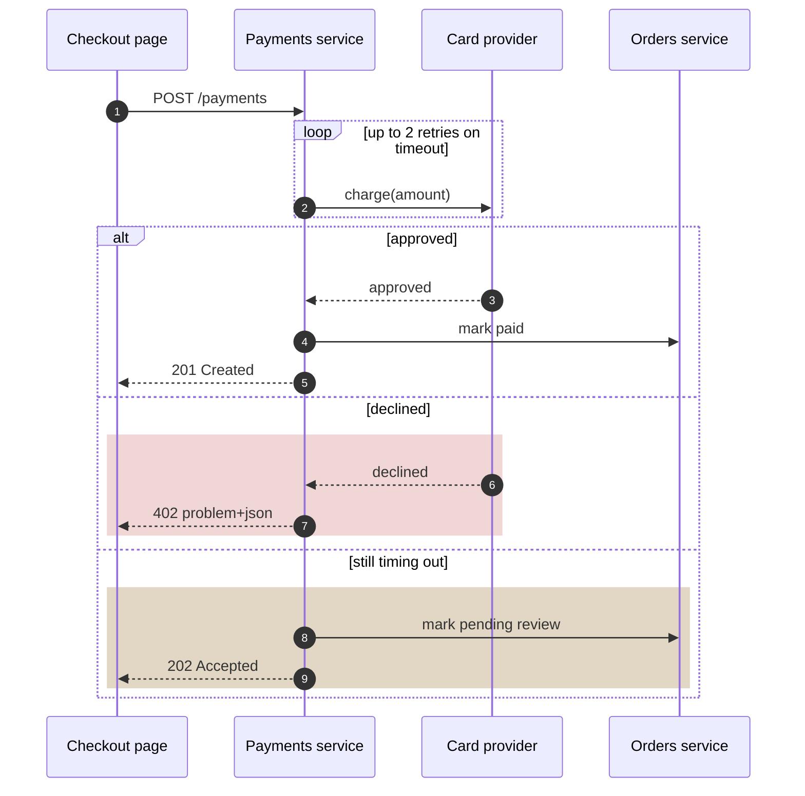
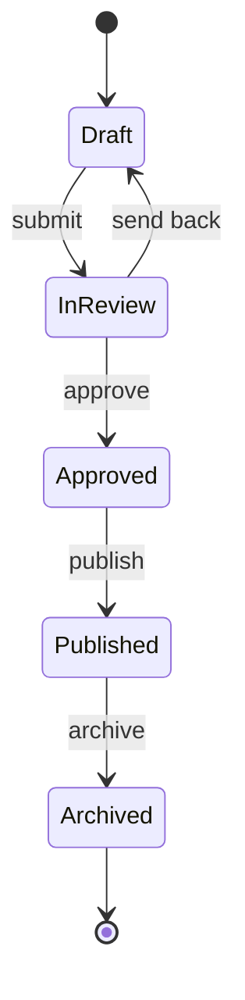
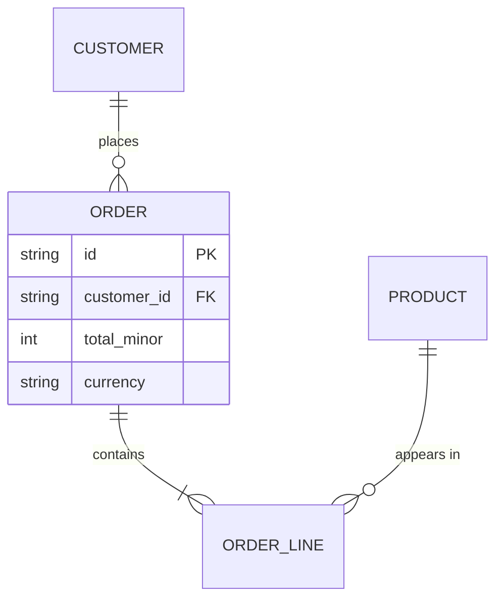

# Diagram recipes

Shapes for the three types that go wrong most often. Copy the shape, replace the nouns.

## Contents

- [Messages over time: sequenceDiagram](#messages-over-time)
- [Lifecycle of one entity: stateDiagram-v2](#lifecycle-of-one-entity)
- [Tables and cardinality: erDiagram](#tables-and-cardinality)

## Messages over time

Draw the reply leg (`-->>`) of every call; a sequence with only requests is a flowchart in disguise. Use `alt` for outcomes, `loop` for retries, and a tinted `rect` for the failure region.

## Lifecycle of one entity

States are nouns, transitions are events; mark start and end states.

## Tables and cardinality

Use the crow's-foot markers for 1:N and N:M; put only the keys and the fields the reader needs.

