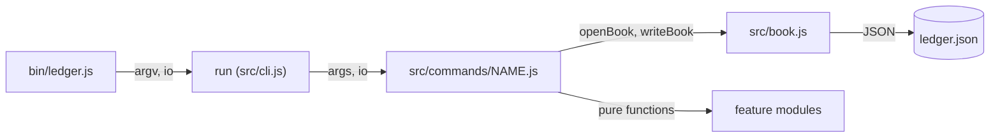

# Design

## Context

`ledger` today is one script and two modules (all ES modules, Node 22, no dependency):

- `bin/ledger.js` parses `process.argv` by hand, knows the commands `add` and `balance`, and calls `process.exit(2)` on an error.
- `src/money.js`: `parseAmount(text): number` (decimal units to integer cents; throws an `Error` on anything else) and `formatCents(cents): string` (two decimals).
- `src/book.js`: `BOOK_FILE` (`"ledger.json"`), `loadBook(path = BOOK_FILE)` (a missing file is `[]`; throws when the content is not an array), `saveBook(entries, path = BOOK_FILE)`.
- Tests use `node:test` and `node:assert/strict`; `npm test` runs `node --test`, which finds `src/*.test.js` and every `.js` file under `test/`. `test/cli.test.js` spawns `bin/ledger.js` in temporary directories.

Every feature of the proposal reads or changes the book, so the book format and the way a command is written are the contracts every other piece depends on.

## Goals / Non-Goals

**Goals:** a book format that holds all new data and reads old files; commands that can be added as separate modules without touching a shared file; pure, unit-tested modules under every command; tests that never depend on the real date.

**Non-Goals:** a persistent store other than one JSON file; locking against two `ledger` processes at once; currencies.

## Decisions

### D1. Book version 2 in `src/book.js`

`src/book.js` keeps `BOOK_FILE` and gains:

- `emptyBook(): Book`, the book `{ version: 2, accounts: ["main"], categories: [], rules: [], budgets: [], recurring: [], entries: [] }`. Rules are `{ pattern, category }`, budgets `{ category, limit }` (limit in cents), recurring entries `{ id, day, amount, description, account, category, from }`.
- `loadBook(path): Book`: a missing file gives `emptyBook()`; an array is migrated (spec `ledger`, "Book file"); an object with `version: 2` whose six collections are arrays is returned as read; anything else throws an `Error`.
- `saveBook(book, path): void`: JSON with two-space indentation and a final newline, written to `<path>.tmp` and renamed onto `path`, so a process that dies while writing leaves the old book.
- `isName(text): boolean`, the account and category name rule `^[a-z][a-z0-9-]*$`.

Commands never call `loadBook` and `saveBook` directly; they use `openBook` and `writeBook` of D2, which turn a read error into the spec's message. A command changes the book in memory and writes it once at its end, so a failed command leaves the file unchanged.

Alternative: one file per collection - lost, one file keeps the "current directory holds the book" rule and the migration simple.

### D2. Command toolkit and dispatcher in `src/cli.js`

`bin/ledger.js` becomes a thin entry point: `process.exitCode = await run(process.argv.slice(2), { cwd: process.cwd(), env: process.env, out, write, err })`, where `out(line)` and `err(line)` write one line and a line break to stdout or stderr, and `write(text)` writes text to stdout as it is. `src/cli.js` exports:

- `class UsageError extends Error`: a user error; `run` prints `ledger: <message>` to stderr and returns 2. Any other error is a bug: `run` does not catch it, so Node prints its stack and the exit code is 1.
- `run(argv, { cwd, env, out, write, err }): Promise<number>`: validates `LEDGER_TODAY`, builds `io = { cwd, today, out, write, err }`, and dispatches `argv[0]` to the module `src/commands/<name>.js`. The commands are the `.js` files of `src/commands/` that do not end in `.test.js`, read with `readdirSync(join(import.meta.dirname, "commands"))` (the directory next to `src/cli.js`, never `io.cwd`) and sorted by name; a name not among them is `unknown command <name>`. No argument, `--help` or `help` prints the help of spec `ledger` ("Commands") from each module's `summary`, in that sorted order.
- A command module exports `summary` (one line for the help) and `run(args, io)`, which may be async, writes through `io.out`, and throws `UsageError` for user errors. It returns nothing; `run` of the dispatcher then returns 0.
- `parseArgs(args, names): { positionals: string[], options: Record<string, string> }`: `--<name> <value>` options, only the given names, spec `ledger` ("Options").
- `subcommand(command, args, names): string`: `args[0]` when it is one of `names`, otherwise `UsageError("<command> needs one of <names in name order, joined by ', '>")`. A command with subcommands calls it on its raw arguments first, then `parseArgs(args.slice(1), <the options of that subcommand>)`, so `ledger recurring list --day 3` is an unknown option.
- `openBook(io): Book` and `writeBook(io, book): void` on `<io.cwd>/ledger.json`; `openBook` throws `UsageError("cannot read ledger.json")` on a read error.
- `readAmount(text): number` (`not an amount: <text>`), `readDate(text): string` (`invalid date <text>`), `readMonth(text): string` (`invalid month <text>`), `requireAccount(book, name)` (`no account <name>`), `requireCategory(book, name)` (`no category <name>`): argument checks every command shares, each throwing `UsageError`.

`add` and `balance` move to `src/commands/add.js` and `src/commands/balance.js`.

Because the dispatcher finds commands by file name, every later feature adds its own command file and touches no shared file; parallel work on the features never edits the same file.

Alternative: a command table in `cli.js` - lost, every feature would edit it. Alternative: commands that write to `process.stdout` themselves - lost, `io` lets a test or a later caller capture the output. Alternative: an argument parser library - lost, one option form does not justify a dependency.

### D3. Dates in `src/dates.js`

`isDate(text)` (a real calendar date `YYYY-MM-DD`), `isMonth(text)` (`YYYY-MM`, months 01-12), `monthOf(date): string`, `localDate(now = new Date()): string` (the local calendar date, not UTC), and `monthsFrom(first, last): string[]` (every month from `first` to `last`, both `YYYY-MM`, inclusive; `[]` when `first` is after `last`, so a recurring entry that starts after today adds nothing). Dates stay strings everywhere: `YYYY-MM-DD` sorts and compares as text. Today is `io.today`, never `new Date()` in a command.

Alternative: `Date` objects - lost, time zones turn a date into the day before.

### D4. Accounts and transfers: `src/accounts.js`, `src/transfers.js`

`addAccount(book, name)` and `accountBalances(book): { name, balance }[]` in account order. `transfer(book, { amount, from, to, date }): string` checks the spec's errors, appends the two entries of spec `ledger-accounts` ("Transfers") and returns the transfer id; N counts the distinct `transfer` ids of the book. Commands `account` (`add`, `list`) and `transfer`.

A transfer is two ordinary entries linked by an id, so balances, lists and exports need no special case. Alternative: a separate `transfers` collection - lost, every balance would have to add it in.

### D5. Categories and rules: `src/categories.js`, `src/rules.js`

`addCategory(book, name)` and `categoryNames(book)` (name order). `addRule(book, pattern, category): number` (the rule's position), `ruleMatches(rule, description): boolean` (case-insensitive substring), `categorize(book): number` (spec `ledger-categories`, "Categorize"). Commands `category` (`add`, `list`), `rule` (`add`, `list`) and `categorize`.

Rules run only when the user runs `categorize`, so an import or an `add` never changes a category behind the user's back. Alternative: categorize on every `add` and `import` - lost, it couples three features and hides when a category was set. Alternative: regular expressions as patterns - lost, a substring covers the bank descriptions users type and cannot fail to compile.

### D6. Import: `src/csv.js`, `src/statement.js`, `src/dedupe.js`

`parseCsv(text): { line: number, fields: string[] }[]`: one record per non-empty line, the line number counted from 1, quotes as in spec `ledger-import`. `readStatement(records, file): { date, description, amount }[]` finds the columns and converts every value, throwing `UsageError` with the spec's message at the first bad line. `freshRows(entries, rows): { fresh, skipped }` applies the duplicate rule of spec `ledger-import` against the target account's entries, by counting equal `date`, `description` and `amount`. Command `import` reads the file with `node:fs`, resolving it against `io.cwd`, and writes the book only after every line converted.

A line with both `debit` and `credit` empty, or both filled, is a bad line (spec `ledger-import`). The column choice (`description` before `payee`, `amount` before `debit`/`credit`, the first of two equal names) lives in `readStatement`.

Alternative: one module - lost, the CSV reader, the column mapping and the duplicate rule are each tested alone.

### D7. Budgets and recurring entries: `src/budgets.js`, `src/recurring.js`

`setBudget(book, category, limit)` replaces in place, keeping the first position. `budgetStatus(book, month): { category, limit, spent, left }[]` in budget order, all in cents; `spent` is the negated sum of the month's entries in the category. Transfer entries never have a category, so they never count. `addRecurring(book, { amount, description, day, account, category, from }): string` and `dueEntries(book, today): Entry[]` (spec `ledger-recurring`, "Due entries", using `monthsFrom` of D3); entries of one date follow the order of `book.recurring`, never a text sort of the ids. Commands `budget` (`list`, `set`) and `recurring` (`add`, `list`, `run`).

Budget status is computed from the entries on every call, never stored, so it cannot go stale. Alternative: keep a running total per budget - lost, every command that adds or changes an entry would have to update it. The days 29-31 are refused, so every month has the due day. The day check (`day must be 1 to 28`) lives in `addRecurring`; the `--day` presence check (`recurring add needs --day`) in the `recurring` command. Alternative: clamp to the month's last day - lost, a rule that moves between days is harder to explain and to test.

### D8. Views: `src/filter.js`, `src/export.js`

`readFilter(book, options): Filter` checks `--month`, `--account` and `--category` (spec `ledger-views`) and `selectEntries(book, filter): Entry[]` returns the matching entries sorted by date, stable for equal dates. `toCsv(entries): string` and `toJson(entries): string` (spec `ledger-views`, "Export"), each ending with its own final line break; the `export` command checks `--format` (`unknown format <text>`) and writes the text with `io.write`, not `io.out`. Commands `list` and `export`.

One filter module serves both commands, so `list` shows exactly what `export` writes. Alternative: filters inside each command - lost, two copies of the month and category rules.

### D9. Reports: `src/reports/`

`renderTable(header, rows, align): string[]` in `src/reports/table.js` (spec `ledger-reports`, "Report tables"; `align` holds `"left"` or `"right"` per column). `monthlyRows(entries, year)`, `categoryRows(entries, month)` and `budgetRows(book, month)` return the rows as strings, the last reusing `budgetStatus` of D7 so `ledger report budget` and `ledger budget list` never disagree. Every report leaves out entries with a `transfer` id. Command `report` with the report names as subcommands; it checks `--year` (four digits, `invalid year <text>`) itself, as only the monthly report takes a year.

The row functions return strings and the table renderer only lays them out, so each report is tested without the layout and the layout once. Alternative: one function per report that returns the printed text - lost, every test would compare whole tables.

### D10. Tests

Unit tests next to each module (`src/<module>.test.js`, `src/reports/<module>.test.js`); command tests in `test/<command>-cli.test.js` through `test/helpers.js`. The version 1 tests in `src/book.test.js` and `test/cli.test.js` are rewritten for version 2 and the helper. `node --test` also loads `test/helpers.js` as a test file; it declares no test, so it adds nothing to the run. Alternative: a helper outside `test/` - lost, it is test code and belongs with the tests. `test/helpers.js` exports `ledger(dir, ...args)` (spawns `bin/ledger.js` in `dir` with `LEDGER_TODAY=2026-10-08` unless the test passes `{ env }` as the last argument; returns `{ status, stdout, stderr }`), `newDir()` (a temporary directory), `writeBook(dir, fields)` (writes `{ ...emptyBook(), ...fields }` as the book) and `readBook(dir)`. A spec scenario is verified by the test of the command it names.

## Diagrams

## Risks / Trade-offs

- [A failing command after a partial change] -> the book is written once, at the end of a command that succeeded, through a temporary file and a rename (D1).
- [Floating point in amounts] -> cents are integers everywhere; `parseAmount` and `formatCents` are the only conversions.
- [A command file added by mistake, such as a helper in `src/commands/`] -> only modules there are commands; helpers live elsewhere (D2).

## Open Questions

None.
