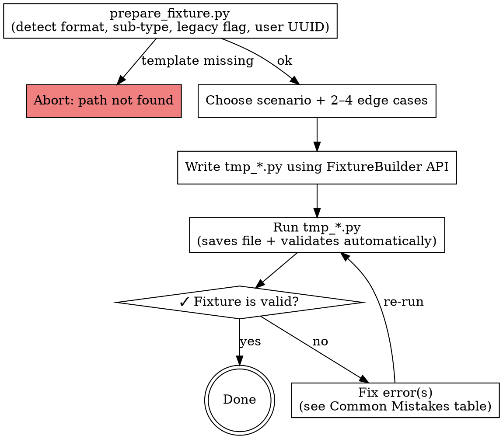

# Create Fixture

Invoked as: `/create-fixture $ARGUMENTS`

- `$ARGUMENTS[0]` — path to `template.html` (e.g. `tests/fixtures/orv1/nype46/template.html`)
- remaining `$ARGUMENTS` — free-form instructions (scenario, edge cases, notes)

---

## New Fixture Workflow

!`.venv/bin/python ${CLAUDE_SKILL_DIR}/scripts/prepare_fixture.py $ARGUMENTS[0]`

Generate a realistic synthetic test document (`document_gen_*.html`) by copying `template.html` verbatim and then editing specific lines to inject tracked changes, placeholder fills, and edge-case patterns for migration testing.



### Steps

1. Read the **FIXTURE PREPARATION CONTEXT** printed above by `prepare_fixture.py`. It contains:
   - **Format** (`froala` or `sea`) — which builder class will be used
   - **Sub-type** (e.g. `nype46`, `nype93`) — which edge cases and span structures apply
   - **Legacy flag** — whether `data-or-legacy-html` is required (always set by `save()`)
   - **User UUID** — injected automatically by the builder; no manual step needed
   - **Available edge cases** — list of EC IDs valid for this sub-type
   If the context is missing or shows an error (bad path, template not found), abort with a clear message.
3. Verify `template.html` exists at `$ARGUMENTS[0]` if the context step failed
4. Choose scenario and 2–4 edge cases from the available list in the context (see sections below)
5. Decide the output filename: `document_gen_<scenario>_<short-slug>.html` in the same directory as `template.html`
6. **Before writing any deletion:** extract the exact text you intend to delete by running `grep -o` against the **template**. Only delete text that appears verbatim. If grep returns nothing, choose a different target or skip that deletion.
7. **Write `tmp_<slug>.py`** using the `FixtureBuilder` API (~60 lines). The builder handles IDs, timestamps, legacy attr, and validation automatically:
   ```python
   import sys
   sys.path.insert(0, "${CLAUDE_SKILL_DIR}/scripts")
   from fixture_builder import FixtureBuilder

   b = FixtureBuilder.from_template("tests/fixtures/sea/nype46/template.html")

   # Fill placeholders (dfplaceholder elements, identified by ID)
   b.fill_placeholder("cke_36_df_0", "MV PASIR GUDANG")

   # Fill freetextfield (SEA only — no ID, use 1-based index in document order)
   b.fill_freetextfield(1, "Hamburg")

   # Tracked changes
   b.delete("Steamship/Motorship")
   b.replace("2 1/2", "3.75")
   b.insert_after("in ballast", ", trimmed")

   # Output (saves file, sets data-or-legacy-html, validates automatically)
   b.save("document_gen_negotiated_pasir-gudang.html")
   ```
8. Run the script: `.venv/bin/python tmp_<slug>.py`
9. `save()` automatically runs the validator after writing the file. If it raises a validation error, apply the fix from the **Common Mistakes** table below and re-run. Repeat until the script exits without error. No separate validation step is needed.

---

## What Tracked Changes Are

A **deletion** means a negotiating party struck out text that was already in the template — the original boilerplate text is wrapped in a `fr-tracking-deleted` span so the reader can see what was removed.

**The text inside a deletion span must exist verbatim in the template.** This is not a convention — it is the only physically valid operation. The `delete()` method wraps existing template text in deletion markup. It cannot invent text that was never there.

Example: if the template contains `"Steamship/Motorship"`, you can delete `"Steamship/Motorship"`. You cannot delete `"Motorship/Vessel"` — it is not in the template, so there is nothing to strike through. The `delete()` method will raise `ValueError` if the text is not found.

An **addition** means a party inserted new text that was not in the template — new words wrapped in a `fr-highlight-change` span. Addition text is freely invented (vessel names, ports, hire rates, etc.).

A **placeholder fill** is a special case of addition: an `<a data-recap-type="addition">` anchor that was empty in the template now has an addition span appended immediately after it, supplying the negotiated value (e.g. vessel name, delivery port).

**Summary: you can only delete what the template already contains. You can freely invent what you add.**

## FixtureBuilder API Reference

See `references/fixture-builder-api.md` for the full API reference: all methods, error messages, format details, and examples.

## HTML Structure Reference

See `references/html-format.md` — load sections as needed:
- `§2` Froala wrappers (per sub-type)
- `§3` Froala tracked change patterns
- `§4` Froala placeholder patterns
- `§5–§7` SEA equivalents
- `§8` Metadata attribute rules

**Do not read existing `document_test*.html` fixtures** to understand the format — `html-format.md` §3/§4 is the authoritative source and reading fixtures wastes tokens with no benefit.

**Froala fixture files are single-line HTML.** Use `grep -o` or `head -c` for content inspection — never `wc -l`, `head -n`, or line-based tools.

## Scenarios

Real negotiated documents contain 100–330 tracked changes (see nype46 test fixtures: 182–330 changes; partial-fill/minimal: 13–81).

| Scenario | What to produce | Target changes | Row spread |
|----------|----------------|---------------|------------|
| `negotiated` | Vessel spec deletions + delivery/redelivery ports + hire rate + voyage description + trading limits rewrites + P&I fill | 150–250 changes | Nearly every content row |
| `clause-removal` | Delete entire optional clause block `(a)*` or `(b)*`; add a "See Clause N." cross-reference | 80–150 changes | Many rows, concentrated in clause blocks |
| `wholesale-reset` | Wrap every text segment in deletion markup; zero additions (all-deleted document) | 200+ changes | Nearly every content row |
| `partial-fill` | Fill 3–5 placeholders, leave rest empty; 2–3 short text additions scattered | 10–20 changes | Spread across first 20 rows |
| `stress-test` | Many short additions and deletions on same lines; multiple edge cases combined | 200–300 changes | Nearly every row, multiple changes per row |

## Edge Cases

Include at least 2. Do not repeat the same edge case in one document.

| ID | Pattern |
|----|---------|
| ec1 | Addition span **immediately adjacent to placeholder** `<a>` with no whitespace between |
| ec2 | Deletion that ends **mid-phrase** (not at a sentence boundary) |
| ec3 | **3+ addition spans** within a single `<tr>` / `<p>` |
| ec4 | **Deletion + replacement pair** — `fr-tracking-deleted` immediately followed by `fr-highlight-change` |
| ec5 | **Empty line between tracked changes** — `<tr>` / `<p><br>` row between two rows with changes |
| ec6 | **`<br data-change-type="addition">`** tracked line break (nype81/nype2015 only) |
| ec7 | **Deletion inside smart field** — `<a name="smart-field">` contains a `fr-tracking-deleted` span |
| ec8 | **Long multi-sentence addition** — 20+ word addition (delivery clause, waiver text, voyage description) |
| ec9 | **Clause cross-reference after deletion** — delete full clause, then add `"See Clause 29."` immediately after |
| ec10 | **Back-to-back deletions** — two `fr-tracking-deleted` spans on same line separated only by whitespace |

## Realistic Content Rules

**Generate all values from scratch — do not reuse the same names across documents.**

Vary length and complexity within each document to stress-test the parser:
- At least one **short** value (1–2 words) and one **long** value (5+ words) per category
- Include **special characters** in at least one company name or port: `&`, `.`, `/`, `–`, accented letters (`ø`, `ą`, `ę`, `č`), legal suffixes (`Sp. z o.o.`, `GmbH & Co. KG`, `S.A.`, `B.V.`, `d.d.`)

### Vessel names
`MV` prefix + 1–4 uppercase words. Vary: single word (`MV ARGO`), geographic+noun (`MV BALTIC PIONEER`), descriptive phrase (`MV EASTERN PROMISE OF ROTTERDAM`), with roman numeral or number (`MV CAPE STAR II`).

### Owner companies
Real-sounding shipping companies. Vary: short abbreviation (`OSM Maritime`), full formal name with jurisdiction (`Bernhard Schulte Shipmanagement (Deutschland) GmbH & Co. KG`), Eastern European legal form (`Żegluga Bałtycka Sp. z o.o.`, `Baltijska d.d.`), Scandinavian (`A.P. Møller – Mærsk A/S`).

### Charterer companies
Commodity traders and industrial buyers. Vary: single word (`Vitol`, `Cargill`), formal with subdivision (`Koch Supply & Trading LP, Commodity Division`), French/Spanish style (`Société Anonyme de Commerce Maritime S.A.`, `Čez Komodity a.s.`).

### Ports
Use real ports from different regions — do not invent fictional ports. Vary: plain city name (`Rotterdam`, `Busan`), port with country qualifier (`Pasir Gudang, Malaysia`), pilot-station form for delivery/redelivery (`on dropping last outward sea pilot [PORT], [COUNTRY] at any time day/night Sundays and holidays included`), range form (`one safe port not North of [CITY], [COUNTRY] range`). Include diacritics where geographically correct (`Gdańsk`, `Constanța`, `Açu`).

### Cargo types
Dry bulk commodities used in real charter parties. Vary: single word (`bauxite`, `clinker`), qualified phrase (`Fertilizers/Ammonium Sulphate`, `lawful harmless bulk coal`), exclusion form (`Non-HME/IMDG, non-livestock, non-nuclear cargo`).

### Hire rates
USD amounts with spelled-out words, payment interval. Vary: flat rate (`USD 12,500 (Twelve Thousand Five Hundred United States Dollars) per day including overtime, payable every 15 days in advance`), tiered (`USD 9,250 for the first 65 days, USD 11,500 thereafter`), semi-monthly (`payable semi-monthly in advance`).

### Voyage descriptions
Follow the pattern: `one time charter trip [routing] with [cargo] in bulk[, duration about N days without guarantee]`. Vary origin/destination regions (SE Asia → Med, ARA → West Africa, China → Black Sea), add constraints (`always within IWL/INL`, `via good safe port(s)`, `in direct continuation`).

### Dates
Vary format: `14 November 2025`, `3rd January 2026`, `Hamburg, 22 February 2026`, `Singapore, 4th March 2026`.

### Clause references
`See Clause N.` where N is a realistic clause number (28–85). Vary phrasing: `as per Clause 33`, `- See Clause 32`, `trading limits as per Clause 45,`, `See Clause No. 76`.

## Output Filename

`document_gen_<scenario>_<short-slug>.html` where:
- `<scenario>` is the scenario name (e.g. `negotiated`, `stress-test`)
- `<short-slug>` is 2–3 lowercase words from the document content (e.g. vessel name, route) separated by hyphens

Example: `document_gen_negotiated_nordic-star-china.html`

## Common Mistakes

| Mistake | Fix |
|---------|-----|
| Using `[PORT]` or `[VALUE]` style markers | Use real names from the content pool |
| Leaving major placeholders empty in `negotiated`/`stress-test` | Fill all data-field anchors (vessel, owners, charterers, ports, hire rate, laycan, cargo) — see §4: append addition span immediately after `<a data-recap-type="addition" ...></a>` |
| Missing any of the 4 required span attributes | All 4 required: `data-timestamp`, `data-identifier`, `data-user`, `data-change-type` — the builder sets these automatically |
| Wrong timestamp digit count | `<span>`: 13 digits; smart-field `<a>`: 10 digits — the builder handles this |
| Forgetting `data-or-legacy-html="true"` on root div | `save()` sets this automatically — no manual step needed |
| Smart field missing inner span | Required: `<a name="smart-field"><span class="fr-highlight-change">VALUE</span></a>` |
| Deletion wrapping text that wasn't in the template | **Before every deletion, run `grep -o '<exact text>' <template_path>` to confirm it exists verbatim.** If grep returns nothing, the text is not in the template — do not delete it. Never invent deleted text from memory or inference. |
| `delete("x")` + `insert_after("x", "y")` on the same text | After `delete()`, the text is wrapped in deletion markup — `insert_after("x")` will search for the original string and may fail or insert in the wrong place. Use `replace("x", "y")` instead. |
| All additions or all deletions (no mix) | Include both unless `wholesale-reset` scenario |
| Only edge cases at document start/end | Scatter edge cases across different line numbers |
| Using `fill_placeholder()` for `<freetextfield>` elements | Use `fill_freetextfield(index, value)` — freetextfields have no ID attribute; use 1-based index in document order |
