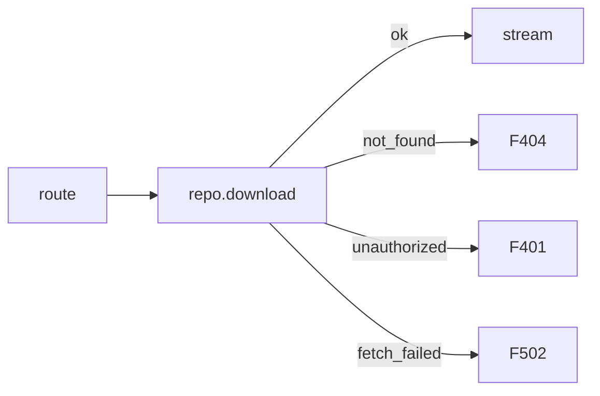

# Plan Template

Use when writing to `.bdk/plans/YYYY-MM-DD-HHMM-<slug>.md`.

---

```markdown
# Plan: [Feature Title - descriptive]

**Created:** YYYY-MM-DD
**Status:** Ready for implementation
**Goal:** [One sentence describing what this builds]
**Architecture:** [2-3 sentences about approach]
**Complexity:** LOW | MEDIUM | HIGH

---

## Context

[2-3 paragraphs:
- What feature does and why needed
- How fits into existing architecture
- Related design docs (if in .bdk/design/)
- Key constraints or requirements]

---

## Constraints (project-wide — apply to every task below)

*Optional but strongly recommended. Omit the section if the project has no global traps.*

- [Type-safety rule, e.g. "No `as` casts, no `any`. Use type-guards in `lib/type-guards.ts` for unknowns."]
- [Layering rule, e.g. "`lib/pm/*` must not import `convex/server`."]
- [Test rule, e.g. "Tests co-located in `__tests__/`. No `test.skip()` for failed preconditions."]
- [Anti-pattern, e.g. "No `eslint-disable`. Fix the type instead."]

---

## Explored Approaches

### Approach 1: [Name] (Selected)

**Description:** [2-3 sentences]

**Pros:**
- [benefit 1]
- [benefit 2]

**Cons:**
- [drawback 1]
- [drawback 2]

**Complexity:** LOW | MEDIUM | HIGH
**Risk:** LOW | MEDIUM | HIGH
**Files to change:** [bulleted list of file paths]

---

### Approach 2: [Name] (Not Selected)

**Description:** [2-3 sentences]

**Pros / Cons:** [brief]

**Why not selected:** [reasoning]

---

## Selected Approach: [Name]

**Rationale:** [Why best, referencing pros/cons]

---

## Implementation Tasks

### Task 1: [Action verb + what]

**Depends on:** T2, T5  *(optional — list task IDs this task requires; omit for independent tasks. Sub-agents executing in parallel rely on this for ordering.)*

**Files:**
- Create: `exact/path/to/new_file.[ext]`
- Modify: `exact/path/to/existing.[ext]`
- Test: `tests/exact/path/test_file.[ext]`

**Use:** `helperA` (`lib/path.ts`), `helperB` (`lib/other.ts`)  *(optional — bind reusable helpers to this task)*

**See:** `existing/pattern.ts:42-60` — mirror the error-handling shape  *(optional — pinpoint example with file:line)*

**Test cases:**

*For code tasks:*
- ✅ Positive: given [input], expects [output]
- ✅ Positive: given [edge case input], expects [edge case output]
- ❌ Negative: given [invalid input], raises [error] *(omit if no meaningful failure mode)*

*For doc-only tasks* (Files: lists only `.md` / docs / templates — no code mutation):
- ✅ `grep -q 'expected-pattern' path/to/file.md` exits 0
- ✅ File `path/to/new.md` exists with non-zero size (`test -f path && test -s path`)
- ❌ Avoid: "re-read and confirm" — that's not a test, that's a manual step

**Test scaffold:**
```
// language-agnostic pseudocode — write in the project's language/framework

// Setup: [fixture or setup needed, e.g. "none", "mock repo", "test container"]

// test: [name matching first case]
//   arrange: [concrete input]
//   act:     [call under test]
//   assert:  [expected output or side effect]

// test: [name matching second case]
//   [...]

// CLI regression tasks: replace stubs with:
//   run [command] — expect exit 0, no errors
```

**Implementation:**

Show the change as a fenced code block. Pick the form that fits:

- **Modifying existing code** → diff fence, `-` for removed, `+` for added.
- **Adding new code** → language-tagged fence (ts, py, go, …) with the full new function/block.
- **Renames / signature flips** → diff fence showing both lines.

Rules:
- No prose paragraphs inside Implementation. Code only.
- One short `**Why:**` line above the block iff the *why* is not obvious from the diff (hidden invariant, contract preserved, surprising choice). Omit otherwise.
- For helper/utility references, use the `**Use:**` and `**See:**` fields above — not Implementation.
- For non-trivial control flow (>2 branches or crosses >2 components), add a `**Flow:**` Mermaid block instead of describing it in prose.

**Example (diff):**

```diff
- const blobToken = process.env["ATTACHMENT_BLOB_READ_WRITE_TOKEN"];
- if (!convexUrl || !blobToken) return err500();
+ if (!convexUrl) return err500();
+ const result = await attachmentRepository().download(attachment.blobKey);
+ if (!result.ok) return mapDownloadError(result.reason);
```

**Example (new code):**

```ts
async download(blobKey: string): Promise<DownloadResult> {
  if (!blobKey) throw new Error("blobKey required");
  return this.store.download(blobKey);
}
```

**Example (Why + Flow):**

**Why:** Preserves the 404 body contract for legacy clients while mapping new failure modes.



> Follow `/bdk:test-driven-development` skill for test writing and red-green-clean cycle.

---

### Task 2: [Next component]

[Same structure as Task 1]

---

[Continue for all tasks — each task: 2-5 minutes]

---

## Reusable Components

**Existing utilities:**
- `file:symbol_path` - [what it does]

**Relevant schemas/models:**
- `file_path` - [what it defines]

**Patterns to follow:**
- [pattern from existing codebase]

**Test helpers:**
- `file:function_path` - [what it does]

---

## Verification

### Tests

Delegate to `test-runner` subagent:
```
Run the project's test suite against the relevant paths for this feature.
Use the test command from `.bdk/settings.json` (injected at session start), or detect from project if not configured.

Target: [specific test paths or modules]
```

### Code Quality

Delegate to `static-analyse` subagent:
```
Run the project's lint/format/type-check commands.
Use the lint command from `.bdk/settings.json` (injected at session start), or detect from project if not configured.
```

### Regression

*(Only if input provided a failing CLI command)*

Delegate to `test-runner` subagent:
```
Run: [exact failing command from input]
Expected: exits 0 with no errors
```

### Edge Cases to Test

- [specific edge case 1]
- [specific edge case 2]

---

## Success Criteria

**Must have:**
- [requirement 1]
- [requirement 2]
- All tests pass
- Static analysis passes
- Coverage meets thresholds

**Nice to have:**
- [optional enhancement]

---

## References

**Code Standards:**

<!-- INJECT: code-quality -->

**Architecture Principles:**

<!-- INJECT: architecture -->

**Design Patterns:**

<!-- INJECT: design-patterns -->

**Security:**

<!-- INJECT: security -->

**Language Rules:**

<!-- INJECT-LANGUAGES -->

**Design Doc:** [path if exists]

**Memories Referenced:**
- [memory_name] - [what was learned]

**Similar Implementations:**
- `file:symbol_path` - [serves as example for what]
```

---

## Notes

**Plan vs. Design:**
- **Design** (from `/bdk:design`): WHAT and WHY — architecture, trade-offs
- **Plan** (this doc): HOW — step-by-step TDD tasks with exact code

**Required sections**: Context, Approaches, Tasks, Verification, Success Criteria
**Optional sections**: Constraints, Reusable Components, References (skip if not applicable)

**Task granularity**: each task = one TDD cycle (2-5 min)
**Test scaffold**: every task must include fixture pattern + arrange/act/assert skeleton
**Code completeness**: every task's Implementation is a fenced code block (diff or full code), never prose.

**Per-task optional fields (signal-when-useful):**
- `Depends on: Tn, Tm` — declare when this task requires another. Independent tasks omit it. Sub-agents executing in parallel rely on this for ordering.
- `Use: helper (path)` — bind reusable helpers/utilities to this task. Saves implementer a search.
- `See: file:line` — pinpoint an existing pattern to mirror. Prefer line ranges over "look at X".
- `Why:` — one short line above the Implementation block when the rationale isn't obvious from the diff.
- `Flow:` — Mermaid block when control flow has >2 branches or crosses >2 components.

**Type shape inline** — for non-trivial discriminated unions or complex types (≥3 fields or ≥2 union variants AND not trivially importable), put the type in a language-tagged fence inside Implementation. Skip for types the implementer can `import`.

**Rule of thumb:** every snippet costs plan length. Trivial one-line change → diff fence with two lines, no Why. Non-obvious mutation → diff fence + one Why line. Architectural choice with branching → Why + Flow. Prose belongs in the approach's Rationale, never inside a task.
