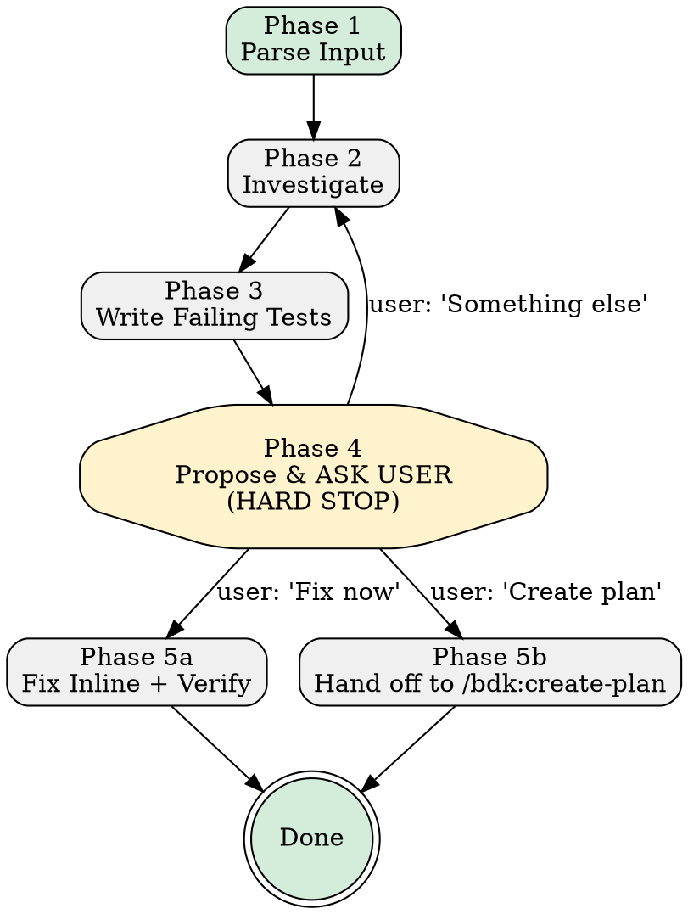

# Debug

> Relies on BDK foundation (STARTUP_INSTRUCTIONS.md) for project context and MCP tool preference.

Diagnose bugs via structured investigation, reproduce with failing tests, then fix or plan.

**Announce at start:** "Using debug to investigate the issue."

**Core principle**: Understand first → test second → confirm with user → fix third.

**On start: create tasks for phases 1–4 only** via `TaskCreate`:
- Phase 1: Parse Input
- Phase 2: Investigate
- Phase 3: Write Failing Tests
- Phase 4: Propose & Wait for User Decision ← HARD STOP

Mark each task complete (`TaskUpdate`) only when phase fully done. **Never mark Phase 4 complete until user responded.**

**After user responds to Phase 4**: create Phase 5 task (`TaskCreate`) for chosen path — "Fix Inline" or "Hand Off to /bdk:create-plan" — then proceed.

---

## Decision Flow



---

## The 5-Phase Workflow

### Phase 1: Parse Input

1. **Validate input**: If empty or vague, ask inline for details, then **stop**
2. **Extract key signals**: error type, failing component, steps to reproduce, expected vs actual
3. **Print summary**:
   ```
   [debug] Issue: {one-line summary}
   [debug] Signals: error={exception class or "none"}, component={file/class or "unknown"}
   ```

**GATE**: Must have enough signal to start investigation.

---

### Phase 2: Investigate

1. **Find entry point**: `semantic_search_nodes(query=<error component or symbol>)` — locate without manual file browsing
2. **Trace callers**: `query_graph(pattern="callers_of", node=<entry_point>)` — trace up the call chain
3. **Trace callees**: `query_graph(pattern="callees_of", node=<entry_point>)` — trace down to dependencies
4. **Identify impacted paths**: `get_affected_flows` — named execution paths through the suspected area
5. **Flag cascading risk**: `get_bridge_nodes_tool` on the affected module — highest-risk choke points
6. **Identify root cause**
7. **Quantify blast radius**: `get_impact_radius(node=<suspected_file>)` — understand scope before proposing fix
8. **Scan for related test gaps** — same class of problem in nearby code only
9. **Print investigation summary**:
   ```
   [debug] Root cause: {one sentence}
   [debug] Affected: {file path}:{line range}
   [debug] Test gaps found: {N}
   ```

**GATE**: Must identify root cause before Phase 3.

---

### Phase 3: Write Failing Tests

Write tests that precisely reproduce bug. Tests RED until fix applied.

**Rules:**
- Each test concrete: specific input values, specific expected outcome
- Follow project test conventions (check existing tests for patterns)
- Place tests in correct existing test file

Inject test command: !`python3 ${CLAUDE_PLUGIN_ROOT}/scripts/get_settings.py test-tools`

Delegate to `test-runner` subagent using injected command above (fall back to detecting from project context if unavailable) to confirm all new tests RED.

```
[debug] Failing tests confirmed: {N} red
```

**GATE**: All new tests must be RED before proceeding.

---

### Phase 4: Propose Solution & Ask User (HARD STOP)

**Mandatory checkpoint. STOP and wait for user decision.**

**Step 1**: Describe proposed solution (what changes, why it fixes root cause, risks)

**Step 2**: Assess complexity:
- **LOW** (inline fix): isolated change affecting one function/call site
- **HIGH** (route to /bdk:create-plan): affects many call sites, introduces new abstractions, changes shared data models

**Step 3**: Ask user via `AskUserQuestion`:

```
## Proposed Fix
{solution summary}

## Complexity: {LOW or HIGH}
{justification}

## What would you like to do?
1. **Fix now** — apply the inline fix and verify tests pass
2. **Create plan** — hand off to `/bdk:create-plan` with failing tests as acceptance criteria
3. **Something else** — redirect, reconsider, investigate more

{recommendation}
```

**`AskUserQuestion` MUST be last tool call in this phase.**

> **HARD STOP: After calling `AskUserQuestion`, output NO text, call NO tools, take NO action. Turn ends here. Phase 4 task stays open. Phase 5 does not start until user replies.**

**GATE**: User explicitly chose option. Only then: mark Phase 4 complete, begin Phase 5.

---

### Phase 5a: Fix Inline

Inject project tools context:

- Test tools: !`python3 ${CLAUDE_PLUGIN_ROOT}/scripts/get_settings.py test-tools`
- Lint tools: !`python3 ${CLAUDE_PLUGIN_ROOT}/scripts/get_settings.py lint-tools`

1. Apply minimal fix
2. Delegate to `test-runner` — run only new failing tests using injected test command
3. Confirm all tests GREEN
4. Delegate to `static-analyse` — run lint/type-check using injected lint command
5. Fix any issues
6. Print final summary:
   ```
   [debug] Done.
     Root cause:   {one sentence}
     Tests added:  {N}
     Fix applied:  {brief description}
     Status:       all tests GREEN
   ```

---

### Phase 5b: Hand Off to /bdk:create-plan

1. Print: `[debug] Routing to /bdk:create-plan`
2. Invoke `/bdk:create-plan` passing:
   - Root cause as feature description
   - Steps to reproduce (verbatim)
   - Failing test file path and test names as acceptance criteria
   - Architectural constraints discovered during investigation

---

## Key Principles

- **Investigate before testing** — understand first
- **Tests define bug** — failing test is contract
- **Phase 4 is hard stop** — ALWAYS wait for user decision
- **Inline questions for info, AskUserQuestion for decisions**
- **Minimal fix** — change only what failing tests require
- **NEVER hardcode test or lint commands** — detect from project context

## Anti-Patterns

- NEVER fix before writing failing test
- NEVER proceed past Phase 4 without user confirmation
- NEVER route to /bdk:create-plan without passing failing test paths
- NEVER scan entire codebase for gaps — only code already read
- NEVER call any tool after `AskUserQuestion` in Phase 4 — turn ends there
- NEVER mark Phase 4 task complete before user responds
- NEVER start Phase 5 without first creating Phase 5 task and Phase 4 marked complete