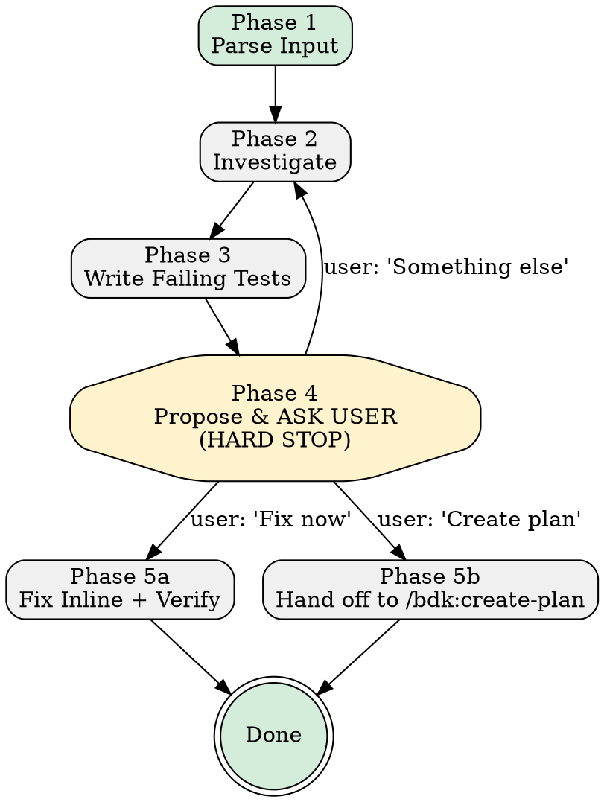

# Debug

> Relies on BDK foundation (STARTUP_INSTRUCTIONS.md) for project context and MCP tool preference.

Diagnose bugs through structured investigation, reproduce them with failing tests, then fix or plan — depending on complexity.

**Announce at start:** "Using debug to investigate the issue."

**Core principle**: Understand first → test second → confirm with user → fix third.

---

## Decision Flow



---

## The 5-Phase Workflow

### Phase 1: Parse Input

1. **Validate input**: If empty or vague, ask inline for details, then **stop**
2. **Extract key signals**: error type, failing component, steps to reproduce, expected vs actual
3. **Print summary**:
   ```
   [debug] Issue: {one-line summary}
   [debug] Signals: error={exception class or "none"}, component={file/class or "unknown"}
   ```

**GATE**: Must have enough signal to start investigation.

---

### Phase 2: Investigate

1. **Find the entry point** using Tier 1/2/3 tools per BDK foundation
2. **Trace the execution path** — follow call chain to failure
3. **Identify root cause**
4. **Scan for related test gaps** — same class of problem in nearby code only
5. **Print investigation summary**:
   ```
   [debug] Root cause: {one sentence}
   [debug] Affected: {file path}:{line range}
   [debug] Test gaps found: {N}
   ```

**GATE**: Must have identified root cause before Phase 3.

---

### Phase 3: Write Failing Tests

Write tests that precisely reproduce the bug. Tests will be RED until the fix is applied.

**Rules:**
- Each test must be concrete: specific input values, specific expected outcome
- Follow project test conventions (check existing tests for patterns)
- Place tests in the correct existing test file

Delegate to `test-runner` subagent to confirm all new tests are RED.

```
[debug] Failing tests confirmed: {N} red
```

**GATE**: All new tests must be RED before proceeding.

---

### Phase 4: Propose Solution & Ask User (HARD STOP)

**This is a mandatory checkpoint. STOP and wait for user decision.**

**Step 1**: Describe the proposed solution (what changes, why it fixes root cause, risks)

**Step 2**: Assess complexity:
- **LOW** (inline fix): isolated change affecting one function/call site
- **HIGH** (route to /bdk:create-plan): affects many call sites, introduces new abstractions, changes shared data models

**Step 3**: Ask the user using `AskUserQuestion`:

```
## Proposed Fix
{solution summary}

## Complexity: {LOW or HIGH}
{justification}

## What would you like to do?
1. **Fix now** — apply the inline fix and verify tests pass
2. **Create plan** — hand off to `/bdk:create-plan` with failing tests as acceptance criteria
3. **Something else** — redirect, reconsider, investigate more

{recommendation}
```

**AFTER calling AskUserQuestion: STOP. Do nothing else. Wait for response.**

**GATE**: User has explicitly chosen an option.

---

### Phase 5a: Fix Inline

1. Apply the minimal fix
2. Delegate to `test-runner` — run only the new failing tests
3. Confirm all tests are GREEN
4. Delegate to `static-analyse` — run project's lint/type-check
5. Fix any issues
6. Print final summary:
   ```
   [debug] Done.
     Root cause:   {one sentence}
     Tests added:  {N}
     Fix applied:  {brief description}
     Status:       all tests GREEN
   ```

---

### Phase 5b: Hand Off to /bdk:create-plan

1. Print: `[debug] Routing to /bdk:create-plan`
2. Invoke `/bdk:create-plan` passing:
   - The root cause as the feature description
   - Steps to reproduce (verbatim)
   - Failing test file path and test names as acceptance criteria
   - Architectural constraints discovered during investigation

---

## Key Principles

- **Investigate before testing** — understand first
- **Tests define the bug** — the failing test is the contract
- **Phase 4 is a hard stop** — ALWAYS wait for user decision
- **Inline questions for info, AskUserQuestion for decisions**
- **Minimal fix** — change only what the failing tests require
- **NEVER hardcode test or lint commands** — detect from project context

## Anti-Patterns

- NEVER fix before writing a failing test
- NEVER proceed past Phase 4 without user confirmation
- NEVER route to /bdk:create-plan without passing failing test paths
- NEVER scan the entire codebase for gaps — only code you've already read
