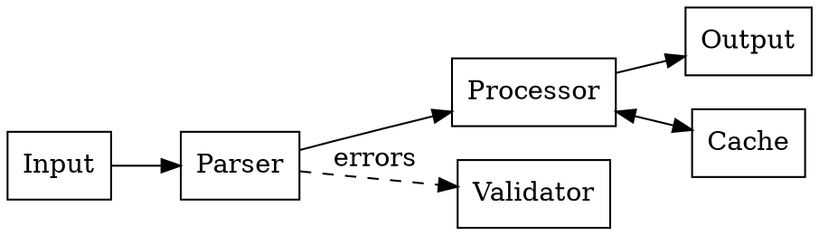
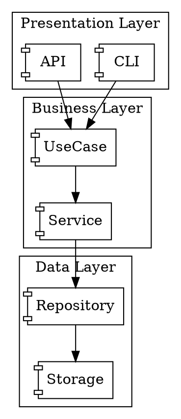
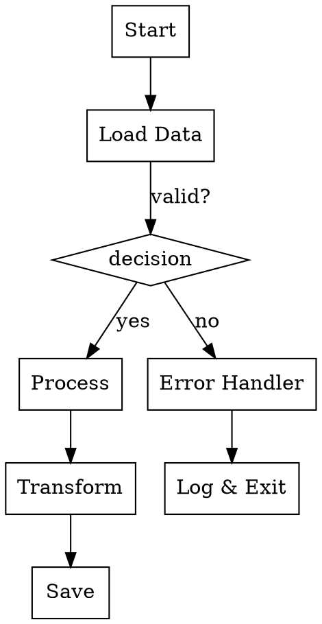
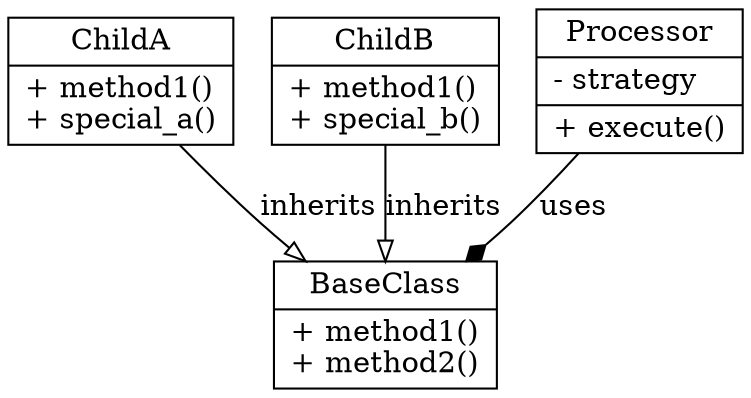
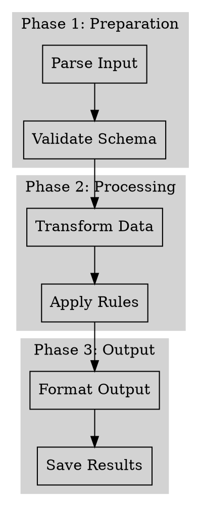

# Graphviz Patterns for Architecture Documentation

## Common Diagram Types

### Data Flow Diagram

Data movement through system:



### Component Architecture

System components and relationships:



### Algorithm Flow

Decision points and processing steps:



### Class Relationships

Inheritance and composition:



### Sequential Process

Step-by-step workflow:



## Style Guidelines

### Node Shapes

- `box` - Process/component
- `diamond` - Decision point
- `ellipse` - Start/end
- `record` - Class/struct with fields
- `component` - System component
- `cylinder` - DB/storage
- `folder` - File/directory

### Edge Styles

- `solid` - Standard flow
- `dashed` - Optional/error path
- `dotted` - Weak dependency
- `bold` - Primary/critical path

### Common Attributes

```dot
// Layout
rankdir=LR  // Left to right (default TB: top to bottom)

// Node styling
node [shape=box, style=filled, fillcolor=lightblue]

// Edge labels
"A" -> "B" [label="transforms"]

// Bidirectional
"A" -> "B" [dir=both]

// Subgraphs/clusters
subgraph cluster_name {
    label="Group Label";
    style=filled;
    color=lightgrey;
    "Node1" -> "Node2";
}
```

### Color Schemes

- `lightblue` - Processing/transformation
- `lightgreen` - Success/valid state
- `lightcoral` - Error/invalid state
- `lightyellow` - Warning/optional
- `lightgrey` - Grouping/container