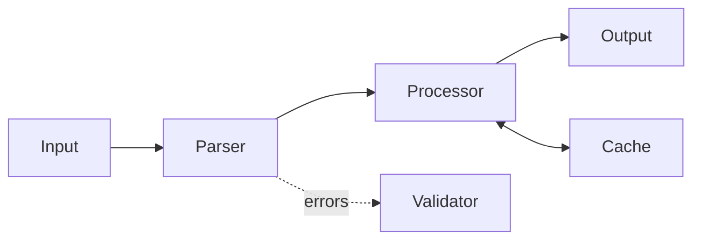
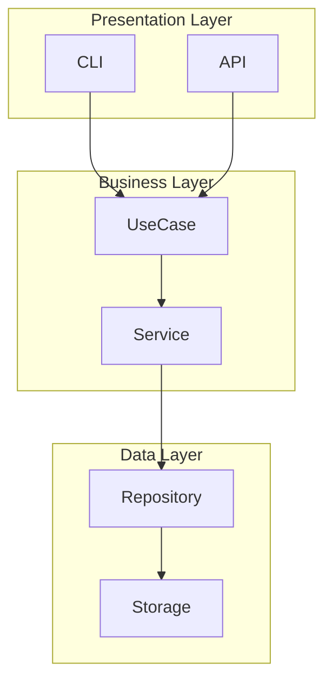
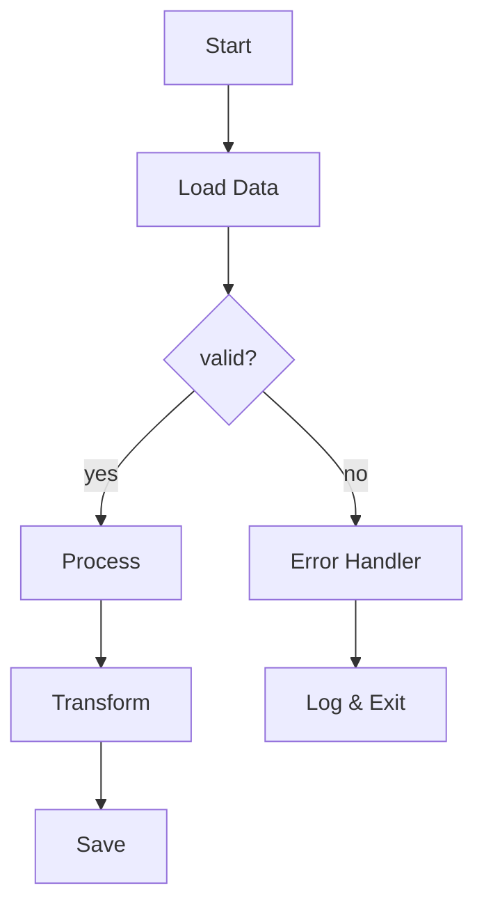
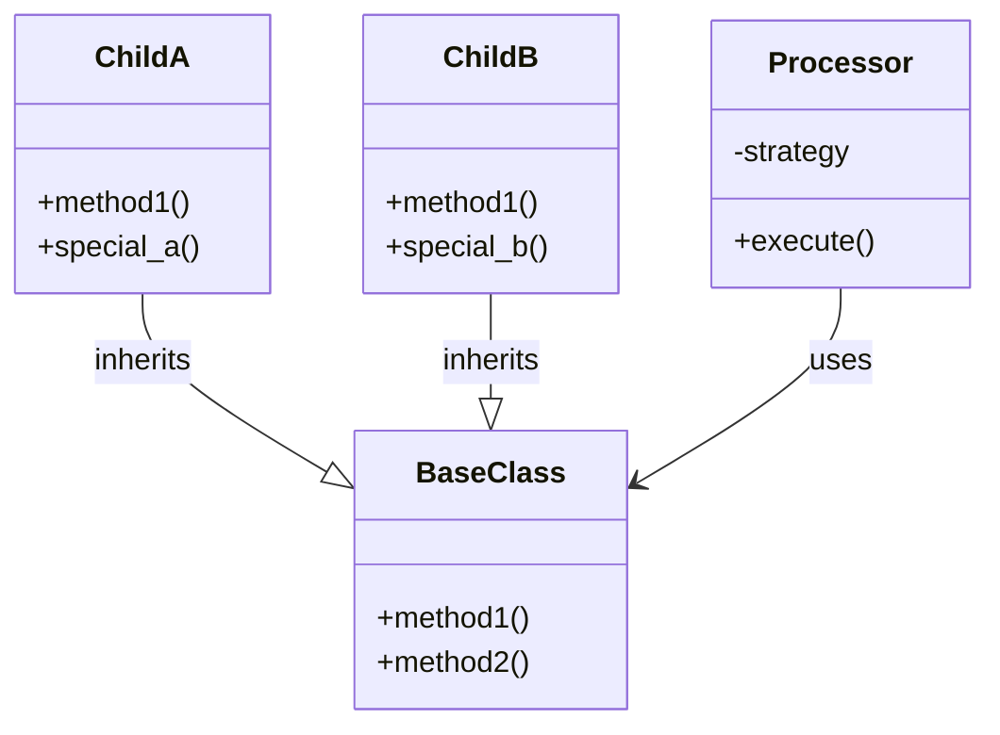
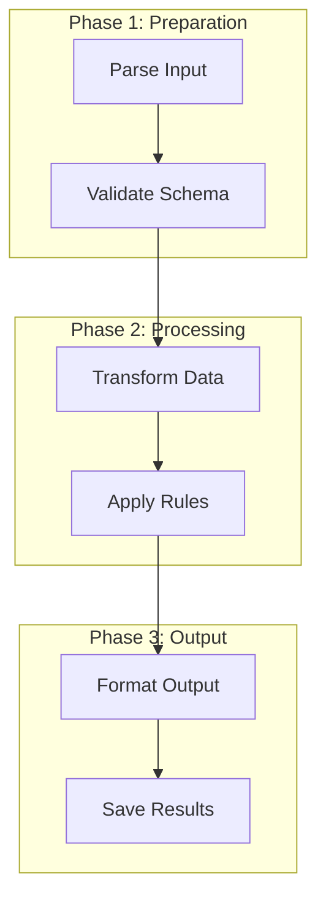
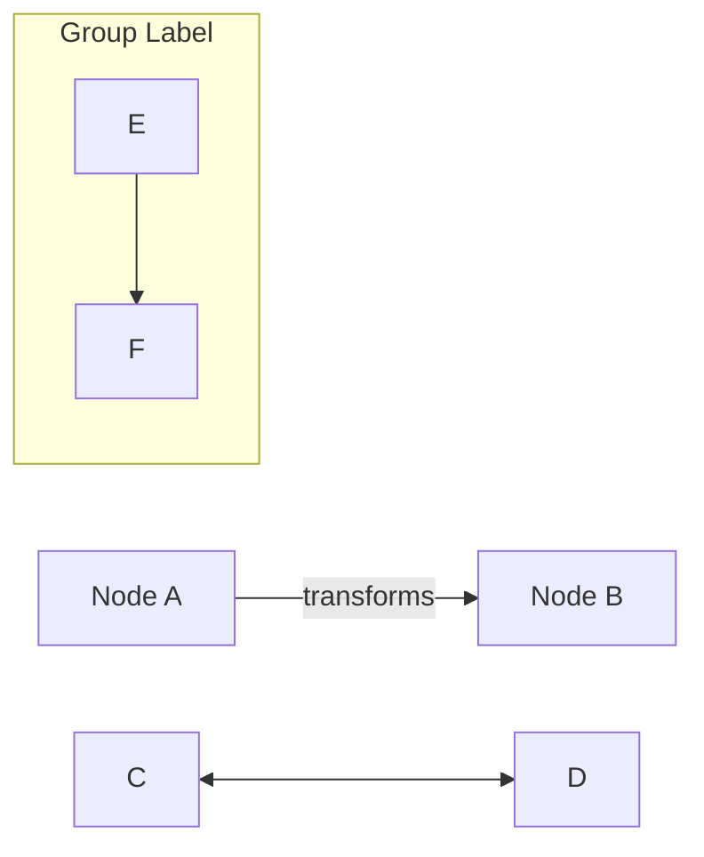
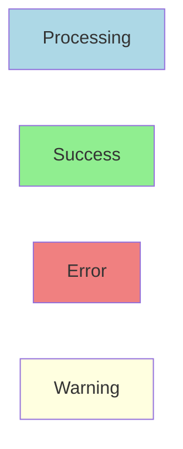

# Mermaid Patterns for Architecture Documentation

## Common Diagram Types

### Data Flow Diagram

Data movement through system:

### Component Architecture

System components and relationships:

### Algorithm Flow

Decision points and processing steps:

### Class Relationships

Inheritance and composition:

### Sequential Process

Step-by-step workflow with phases:

## Style Guidelines

### Node Shapes

- `["text"]` - Process/component (rectangle)
- `{"text"}` - Decision point (diamond)
- `("text")` - Start/end (rounded/stadium)
- `classDiagram` `class` block - Class/struct with fields
- `[("text")]` - DB/storage (cylinder)
- `[/"text"/]` - File/directory (parallelogram)

### Edge Styles

- `-->` - Standard flow
- `-.->` - Optional/error path
- `-.-` - Weak dependency (no arrowhead)
- `==>` - Primary/critical path

### Common Attributes

### Color Schemes

Apply with `classDef` + `class` assignment:

- `#ADD8E6` (lightblue) - Processing/transformation
- `#90EE90` (lightgreen) - Success/valid state
- `#F08080` (lightcoral) - Error/invalid state
- `#FFFFE0` (lightyellow) - Warning/optional
- `#D3D3D3` (lightgrey) - Grouping/container
