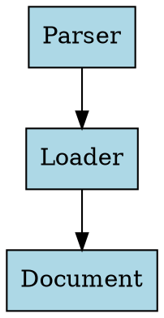

# Graphviz Docs Compiler Skill

## Installation

The skill is packaged and ready to use. The packaged file is located at:
```
.claude/skills/graphviz-docs-compiler.skill
```

## Prerequisites

Install Graphviz on your system:

```bash
# macOS
brew install graphviz

# Ubuntu/Debian
sudo apt-get install graphviz

# Verify installation
dot -V
```

## Quick Start

### 1. Structure Your Documentation

```
docs/
├── module_name.md              # Main documentation
└── module_name/
    ├── diagrams/
    │   └── architecture.dot    # Your Graphviz source files
    └── images/                 # Generated SVG files (auto-created)
```

### 2. Create a Diagram

**File:** `docs/xml_template_loader/diagrams/architecture.dot`



### 3. Reference in Markdown (Optional)

**File:** `docs/xml_template_loader.md`

````markdown
## Architecture


````

### 4. Compile Diagrams

From your project root:

```bash
python ~/.claude/skills/graphviz-docs-compiler/scripts/compile_diagrams.py docs/
```

Or with the skill loaded in Claude Code, just ask:
- "Compile the Graphviz diagrams"
- "Update documentation diagrams"
- "Generate SVG from dot files"

### 5. Result

The markdown file will be updated to:

```markdown
## Architecture


Source: [`diagrams/architecture.dot`](xml_template_loader/diagrams/architecture.dot)
```

## Script Options

```bash
# Dry run (preview changes)
python scripts/compile_diagrams.py docs/ --dry-run

# Verbose output
python scripts/compile_diagrams.py docs/ --verbose

# Specify custom docs directory
python scripts/compile_diagrams.py /path/to/docs/
```

## Troubleshooting

### "Graphviz 'dot' command not found"

Install Graphviz: `brew install graphviz`

### Code block not replaced

- Ensure the `.dot` file content exactly matches the markdown code block (whitespace matters)
- Use `--verbose` flag to see detailed processing information

### Diagram not compiled

Check that:
- The `.dot` file is in a `diagrams/` subdirectory
- The corresponding `.md` file exists in the parent directory
- File structure matches: `docs/module_name/diagrams/file.dot` → `docs/module_name.md`

## Examples

See `references/graphviz-patterns.md` for:
- Flow diagram patterns
- Class/component diagram examples
- Data flow visualization
- Color and style guidelines
- Unicode symbols for labels