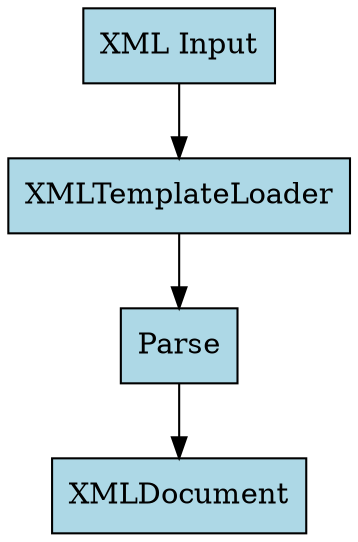

# Graphviz Docs Compiler

Automate the compilation of Graphviz diagrams in documentation by converting `.dot` files to SVG images and updating markdown files to reference the generated images.

## Prerequisites

**System Dependency Required:**

```bash
# macOS
brew install graphviz

# Ubuntu/Debian
sudo apt-get install graphviz

# Verify installation
dot -V
```

The `dot` command must be available in your PATH. The script calls `dot` directly via subprocess - no Python wrapper needed.

## Quick Start

The script supports three modes:

```bash
# Forward mode: Compile existing .dot files to SVG
uv run python skills/graphviz-docs-compiler/scripts/compile_diagrams.py docs/

# Reverse mode: Extract diagrams from markdown to .dot files
uv run python skills/graphviz-docs-compiler/scripts/compile_diagrams.py docs/ --mode reverse

# Both mode: Extract from markdown, then compile all (recommended)
uv run python skills/graphviz-docs-compiler/scripts/compile_diagrams.py docs/ --mode both
```

**What each mode does:**

- **Forward**: Find `.dot` files → compile to SVG → update markdown references
- **Reverse**: Find Graphviz code blocks in markdown → extract to `.dot` files → compile to SVG → update references
- **Both**: Reverse + Forward (extract everything, then compile everything)

## File Organization

Structure your documentation following this pattern:

```
docs/
├── module_name.md              # Main documentation file
└── module_name/
    ├── diagrams/
    │   ├── architecture.dot    # Source Graphviz files
    │   ├── dataflow.dot
    │   └── components.dot
    └── images/                 # Generated SVG files (auto-created)
        ├── architecture.svg
        ├── dataflow.svg
        └── components.svg
```

## Workflow

### Workflow 1: Start with Markdown (Recommended)

Write documentation with embedded Graphviz diagrams, then extract and compile:

**Step 1:** Write documentation with code blocks:

````markdown
# Component Architecture

### Component Diagram


````

**Step 2:** Run reverse + forward compilation:

```bash
uv run python skills/graphviz-docs-compiler/scripts/compile_diagrams.py docs/ --mode both
```

**Result:** Markdown updated to reference images:

```markdown
### Component Diagram


Source: [`diagrams/component-diagram.dot`](module/diagrams/component-diagram.dot)
```

**Generated files:**
- `docs/module/diagrams/component-diagram.dot` (extracted from header text)
- `docs/module/images/component-diagram.svg` (compiled)

### Workflow 2: Start with .dot Files

Create `.dot` files directly, then compile:

**Step 1:** Create diagram source:

```bash
mkdir -p docs/xml_template_loader/diagrams
cat > docs/xml_template_loader/diagrams/architecture.dot << 'EOF'
digraph flow {
    rankdir=TB;
    "Parser" -> "Loader";
}
EOF
```

**Step 2:** Run forward compilation:

```bash
uv run python skills/graphviz-docs-compiler/scripts/compile_diagrams.py docs/ --mode forward
```

**Step 3:** Manually add reference to markdown or let script update code blocks if they exist.

## Script Options

```bash
uv run python skills/graphviz-docs-compiler/scripts/compile_diagrams.py [docs_root] [options]

Arguments:
  docs_root              Root directory for documentation (default: docs/)

Options:
  --mode {forward,reverse,both}
                        Operation mode (default: forward)
                        - forward: .dot → SVG + update markdown
                        - reverse: markdown → .dot → SVG + update markdown
                        - both: reverse + forward (extract all, compile all)
  --dry-run             Show what would be done without making changes
  --verbose, -v         Show detailed output for each diagram
```

## Diagram Naming (Reverse Mode)

When extracting diagrams from markdown, filenames are generated from the preceding header:

```markdown
### Component Diagram       → component-diagram.dot
### Data Flow              → data-flow.dot
### Class: XMLLoader       → class-xmlloader.dot
```

Rules:
- Converts to lowercase
- Replaces spaces with hyphens
- Removes special characters
- Handles duplicates by appending `-2`, `-3`, etc.

## Troubleshooting

### Graphviz not installed

**Error:** `Graphviz 'dot' command not found`

**Solution:**

```bash
# macOS
brew install graphviz

# Ubuntu/Debian
sudo apt-get install graphviz

# Verify installation
dot -V
```

### Code block not replaced in forward mode

**Issue:** `.dot` file compiled but markdown not updated

**Cause:** Code block content doesn't match `.dot` file exactly (whitespace sensitive)

**Solution:** Use `--mode both` or `--mode reverse` to extract from markdown first, ensuring exact match.

### Duplicate diagram names

**Issue:** Multiple diagrams with same header text

**Behavior:** Automatically appends `-2`, `-3` to filenames

**Example:**
```markdown
### Architecture  → architecture.dot
### Architecture  → architecture-2.dot
```

### No diagrams extracted

**Issue:** `0 extracted` when markdown has diagrams

**Check:**
- Code blocks use ` ```dot ` or ` ```graphviz ` fence
- Blocks are preceded by header (`###` or `##`)
- Markdown files in `docs/` directory

## Integration with Documentation Workflow

### Recommended Workflow

1. **Write documentation** with embedded Graphviz code blocks (use `/explain-complex-code` skill)
2. **Extract and compile** with `--mode both` before committing
3. **Commit both** `.dot` files (source) and `.svg` files (compiled output)
4. **Reviewers see** both source and rendered diagrams in GitHub

### Integration with explain-complex-code

The `/explain-complex-code` skill automatically runs diagram compilation via PostToolUse hook:

1. You write documentation with Graphviz diagrams
2. Hook automatically extracts `.dot` files
3. Hook automatically compiles to SVG
4. Hook automatically updates markdown references
5. You review and commit the changes

**Note:** This requires `brew install graphviz` to be run once on your system.

## Example: Full Workflow

Creating documentation for `xml_template_loader.py`:

```bash
# 1. Create documentation structure
mkdir -p docs/xml_template_loader/diagrams

# 2. Create diagram source
cat > docs/xml_template_loader/diagrams/architecture.dot << 'EOF'
digraph flow {
    rankdir=TB;
    node [shape=box, style=filled, fillcolor=lightblue];

    "XML Input" -> "XMLTemplateLoader";
    "XMLTemplateLoader" -> "Parse";
    "Parse" -> "XMLDocument";
}
EOF

# 3. Create markdown file with code block
cat > docs/xml_template_loader.md << 'EOF'
# XML Template Loader

## Architecture


EOF

# 4. Compile diagrams
uv run python skills/graphviz-docs-compiler/scripts/compile_diagrams.py docs/ --verbose

# Result: docs/xml_template_loader.md now contains:
# 
# Source: [`diagrams/architecture.dot`](xml_template_loader/diagrams/architecture.dot)
```

## Resources

### scripts/compile_diagrams.py

Python script that handles diagram compilation and markdown updates. Can be executed directly without loading into context.

