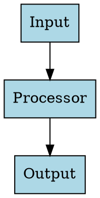

> Relies on BDK foundation (STARTUP_INSTRUCTIONS.md). Assumes environment discovery has already run (language, test runner, build tool are known).

# Graphviz Docs Compiler

Compile Graphviz diagrams in docs — converts `.dot` files to SVG, updates markdown references in-place.

**Argument:** path to docs dir or `.md` file (`$ARGUMENTS`). Defaults to `docs/`.

Use `$ARGUMENTS` as target path passed to `compile_diagrams.py`.

## Prerequisites

`dot` must be in PATH. Script calls it directly via subprocess.

```bash
# macOS
brew install graphviz

# Ubuntu/Debian
sudo apt-get install graphviz

# Verify installation
dot -V
```

## Quick Start

Three modes:

```bash
# Forward mode: Compile existing .dot files to SVG
uv run python skills/graphviz-docs-compiler/scripts/compile_diagrams.py docs/

# Reverse mode: Extract diagrams from markdown to .dot files
uv run python skills/graphviz-docs-compiler/scripts/compile_diagrams.py docs/ --mode reverse

# Both mode: Extract from markdown, then compile all (recommended)
uv run python skills/graphviz-docs-compiler/scripts/compile_diagrams.py docs/ --mode both
```

- **Forward**: `.dot` files → SVG → update markdown refs
- **Reverse**: markdown code blocks → `.dot` files → SVG → update refs
- **Both**: Reverse + Forward (extract all, compile all)

## File Organization

```
docs/
├── module_name.md              # Main documentation file
└── module_name/
    ├── diagrams/
    │   ├── architecture.dot    # Source Graphviz files
    │   ├── dataflow.dot
    │   └── components.dot
    └── images/                 # Generated SVG files (auto-created)
        ├── architecture.svg
        ├── dataflow.svg
        └── components.svg
```

## Workflow

### Workflow 1: Start with Markdown (Recommended)

**Step 1:** Write docs with embedded code blocks:

````markdown
# Component Architecture

### Component Diagram


````

**Step 2:** Extract + compile:

```bash
uv run python skills/graphviz-docs-compiler/scripts/compile_diagrams.py docs/ --mode both
```

**Result:** Markdown updated to:

```markdown
### Component Diagram


Source: [`diagrams/component-diagram.dot`](module/diagrams/component-diagram.dot)
```

Generated:
- `docs/module/diagrams/component-diagram.dot` (extracted from header)
- `docs/module/images/component-diagram.svg` (compiled)

### Workflow 2: Start with .dot Files

**Step 1:** Create diagram source:

```bash
mkdir -p docs/my_module/diagrams
cat > docs/my_module/diagrams/architecture.dot << 'EOF'
digraph flow {
    rankdir=TB;
    "Parser" -> "Loader";
}
EOF
```

**Step 2:** Compile:

```bash
uv run python skills/graphviz-docs-compiler/scripts/compile_diagrams.py docs/ --mode forward
```

**Step 3:** Manually add markdown ref or let script update existing code blocks.

## Script Options

```bash
uv run python skills/graphviz-docs-compiler/scripts/compile_diagrams.py [docs_root] [options]

Arguments:
  docs_root              Root directory for documentation (default: docs/)

Options:
  --mode {forward,reverse,both}
                        Operation mode (default: forward)
                        - forward: .dot → SVG + update markdown
                        - reverse: markdown → .dot → SVG + update markdown
                        - both: reverse + forward (extract all, compile all)
  --dry-run             Show what would be done without making changes
  --verbose, -v         Show detailed output for each diagram
```

## Diagram Naming (Reverse Mode)

Filenames generated from preceding header:

```markdown
### Component Diagram       → component-diagram.dot
### Data Flow              → data-flow.dot
### Class: XMLLoader       → class-xmlloader.dot
```

- Lowercase, spaces → hyphens, special chars removed
- Duplicates → `-2`, `-3`, etc.

## Troubleshooting

### Graphviz not installed

**Error:** `Graphviz 'dot' command not found`

```bash
# macOS
brew install graphviz

# Ubuntu/Debian
sudo apt-get install graphviz

# Verify installation
dot -V
```

### Code block not replaced in forward mode

`.dot` compiled but markdown not updated. Cause: code block content doesn't match `.dot` exactly (whitespace sensitive). Fix: use `--mode both` or `--mode reverse` to extract first.

### Duplicate diagram names

Multiple diagrams with same header → auto-appends `-2`, `-3`:

```markdown
### Architecture  → architecture.dot
### Architecture  → architecture-2.dot
```

### No diagrams extracted

`0 extracted` when markdown has diagrams. Check:
- Code blocks use ` ```dot ` or ` ```graphviz ` fence
- Blocks preceded by header (`###` or `##`)
- Markdown files in `docs/` directory

## Recommended Workflow

1. Write docs with embedded Graphviz code blocks
2. Extract + compile with `--mode both` before commit
3. Commit both `.dot` (source) and `.svg` (output)
4. Reviewers see source + rendered diagrams in GitHub

## Example: Full Workflow

```bash
# 1. Create documentation structure
mkdir -p docs/my_module/diagrams

# 2. Create diagram source
cat > docs/my_module/diagrams/architecture.dot << 'EOF'
digraph flow {
    rankdir=TB;
    node [shape=box, style=filled, fillcolor=lightblue];

    "Input" -> "Processor";
    "Processor" -> "Output";
}
EOF

# 3. Create markdown file with code block
cat > docs/my_module.md << 'EOF'
# My Module

## Architecture


EOF

# 4. Compile diagrams
uv run python skills/graphviz-docs-compiler/scripts/compile_diagrams.py docs/ --verbose

# Result: docs/my_module.md now contains:
# 
# Source: [`diagrams/architecture.dot`](my_module/diagrams/architecture.dot)
```

## Resources

### scripts/compile_diagrams.py

Handles diagram compilation + markdown updates. Execute directly without loading into context.
