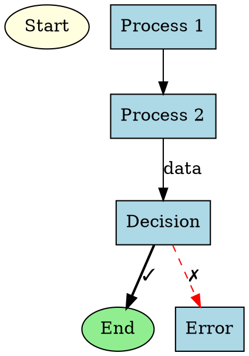
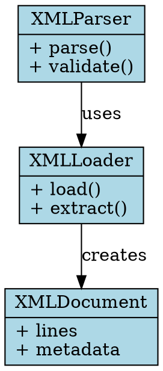
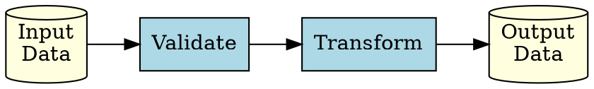

# Graphviz Patterns for Documentation

## Common Diagram Types

### Flow Diagrams



### Class/Component Diagrams



### Data Flow Diagrams



## Style Guidelines

### Colors

- **Input/Output**: `lightyellow` (ellipse or cylinder)
- **Processing**: `lightblue` (box)
- **Success**: `lightgreen` (ellipse)
- **Error/Warning**: `lightcoral` or `red`

### Arrows

- **Normal flow**: Solid line
- **Error path**: Dashed line with `style=dashed`
- **Optional**: Dotted line with `style=dotted`
- **Important**: Bold with `style=bold`

### Labels

- Use Unicode symbols: ✓ ✗ ⚠ ➜ ⊕
- Keep labels short and descriptive
- Use `\l` for left-aligned text in records
- Use `\n` for line breaks in labels

## File Organization

```
docs/
├── module_name.md              # Main documentation
└── module_name/
    ├── diagrams/
    │   ├── architecture.dot    # Source files
    │   ├── dataflow.dot
    │   └── components.dot
    └── images/                 # Generated by compile_diagrams.py
        ├── architecture.svg
        ├── dataflow.svg
        └── components.svg
```

## Markdown Integration

In your documentation, reference diagrams like this:

```markdown
## Architecture


Source: [`diagrams/architecture.dot`](module_name/diagrams/architecture.dot)
```

The `compile_diagrams.py` script will automatically convert code blocks to this format.