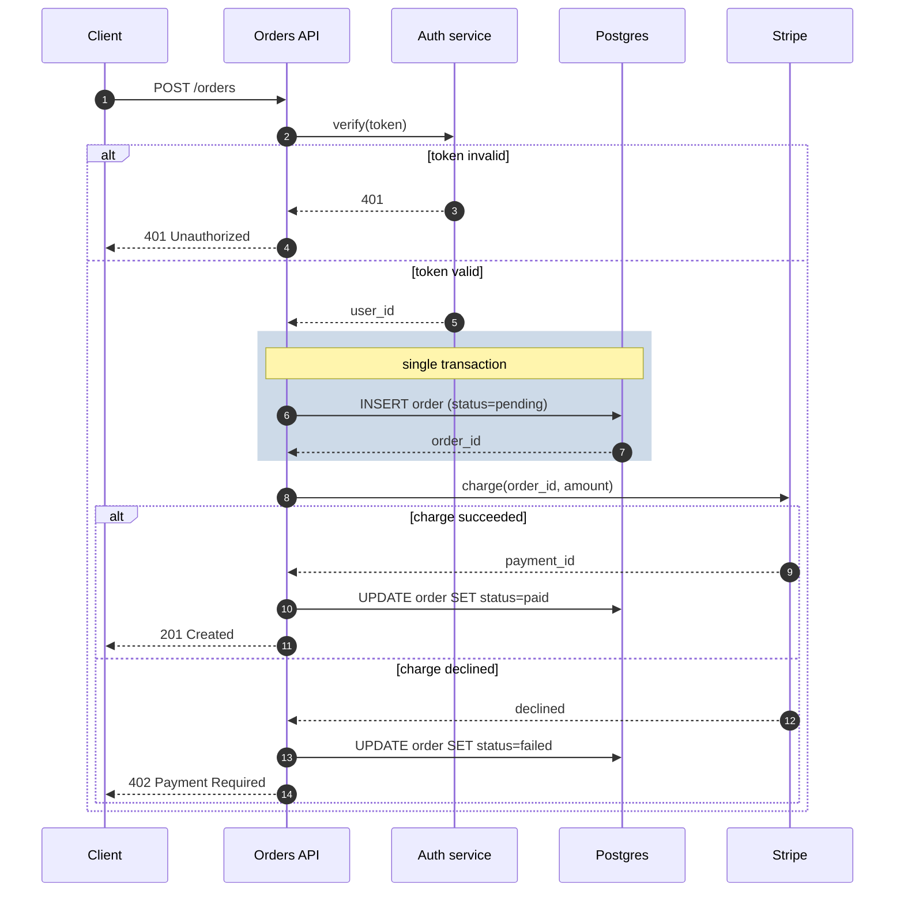
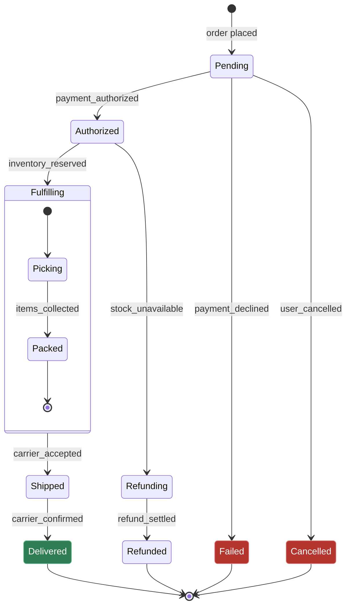
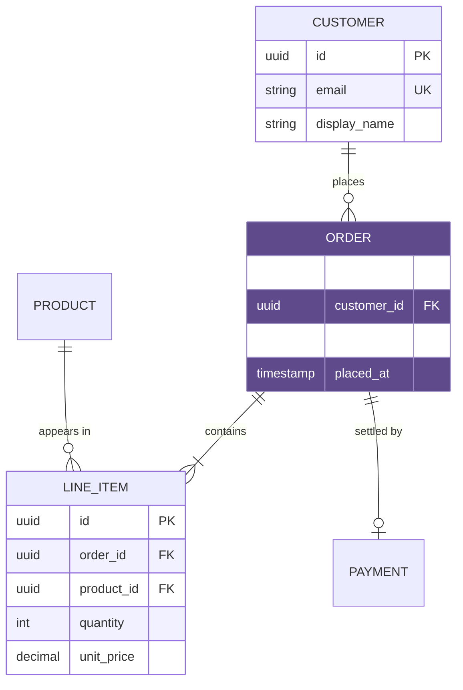

# Diagram Recipes

Worked examples for the three types that go wrong most often. Plain flowcharts are omitted on purpose - they rarely fail.

Each recipe is a real shape, not a syntax dump. Copy the shape, replace the nouns.

## Contents

- [Request flow across services (`sequenceDiagram`)](#request-flow-across-services)
- [Entity lifecycle (`stateDiagram-v2`)](#entity-lifecycle)
- [Data shape and cardinality (`erDiagram`)](#data-shape-and-cardinality)

---

## Request flow across services

Use for anything crossing a process boundary over time: HTTP handlers, RPC chains, webhook round-trips, queue consumers.

The point of this type is what a flowchart cannot show: the **return leg**, who is **blocked** while waiting, and which branch the response took. If your sequence diagram has only `->>` arrows and no `-->>` replies, you have drawn a flowchart with extra steps.

**What makes this one work:**

- `participant X as Label` - short ids keep arrow lines readable, the alias keeps the header human.
- `autonumber` - gives every step a number you can cite in the prose ("the 402 in step 11").
- `alt` / `else` covers **both** outcomes. A sequence diagram showing only the happy path is the one that fails review, because the error path is what the reader came to check.
- `rect rgba(...)` is the only colouring `sequenceDiagram` supports. Use it for a transaction, a lock, a retry window - a region with a property, never for decoration.
- `note over A,B:` labels the region so the tint has a stated meaning.

**Additional blocks worth knowing:**

- `loop until acknowledged ... end` - retry and polling behaviour
- `par ... and ... end` - concurrent calls that do not wait for each other
- `opt cache hit ... end` - a step that sometimes does not happen
- `A-)B: fire and forget` - async send with no reply, distinct from `->>`
- `deactivate` / `activate` (or `->>+` / `-->>-`) - draws the activation bar, showing how long a party is busy

---

## Entity lifecycle

Use when one thing moves through named states: an order, a background job, a connection, a subscription, a PR.

States are **nouns** (what the entity *is*), transitions are **events** (what happened to it). If your state names are verbs, you have drawn a flowchart.

**What makes this one work:**

- `[*]` at both ends. Every state machine has one entry and at least one exit; a diagram with no terminal state hides whether the entity ever finishes.
- Every transition is labelled with the **event that causes it**, not with the state it leads to.
- The nested `state Fulfilling { ... }` block keeps sub-states from inflating the top-level node count. Use it when a single state has interesting internals.
- Colour is applied to terminal states only - the three the reader scans for. Every declared `classDef` is used.

**The check that catches real bugs:** for each state, ask what happens if the process dies there. A state with no timeout or retry transition out of it is a stuck order in production. Drawing the machine is often how that gap gets found.

---

## Data shape and cardinality

Use when the question is what tables/collections exist and how they relate. This is the only type that expresses `1:N` versus `N:M` natively, which is why it belongs in any design that moves the schema.

**Cardinality notation** - the half of `erDiagram` that gets guessed wrong. Read each side independently, left symbol describes the left entity:

| Symbol | Meaning |
|---|---|
| `\|o` / `o\|` | zero or one |
| `\|\|` | exactly one |
| `}o` / `o{` | zero or more |
| `}\|` / `\|{` | one or more |

So `ORDER ||--|{ LINE_ITEM` reads: an order has **one or more** line items, and a line item belongs to **exactly one** order. Contrast with `||--o{`, which allows an order with zero items. Choosing between those two *is* the design decision - do not default to `o{` because it is easier to type.

**What makes this one work:**

- Attribute blocks are included only for the entities the change touches. Listing every column of every table turns the diagram into a schema dump nobody reads.
- `PK` / `FK` / `UK` markers are cheap and answer the first question a reviewer asks.
- Relationship labels are verbs read left-to-right: "CUSTOMER *places* ORDER".
- When documenting a migration, draw **two** diagrams - before and after - rather than one annotated with what is changing. The delta belongs in prose beside them.
