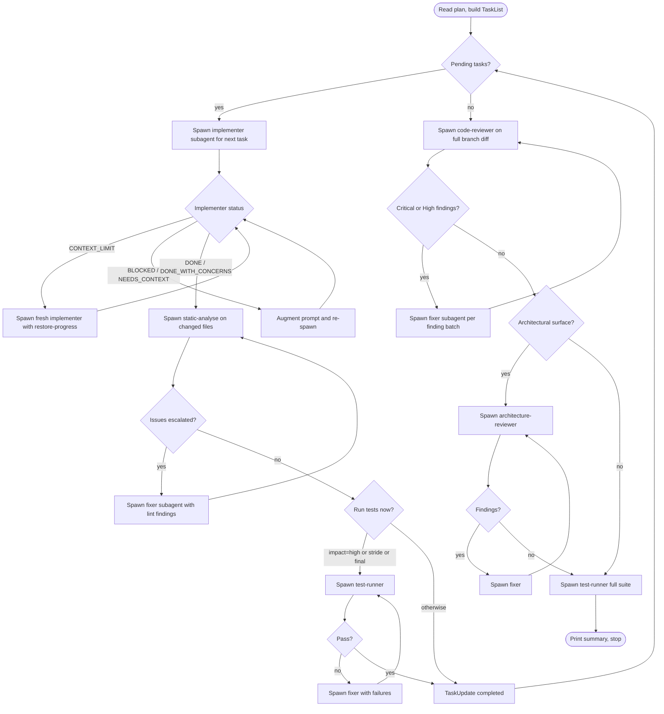

# Subagent-Execute-Plan (Coordinator)

> Relies on BDK foundation (STARTUP_INSTRUCTIONS.md) for project context and MCP tool preference.

This skill is a **coordinator only**. It holds plan state and dispatches subagents. It does no implementation, no editing, no test execution itself. Subagents do the work; the coordinator orchestrates.

**Why coordinator-only:** isolated context per task → no pollution. The coordinator's context stays small (just the plan, TaskList, and last subagent return) so it can run a long plan without hitting the wall itself. Subagents do the heavy lifting and discard their context when they return.

**Core loop:** dispatch implementer → handle status → dispatch reviewer → if findings → dispatch fixer → repeat.

---

## Subagent fleet

| Agent | Purpose | Model | Spawned by |
|---|---|---|---|
| `implementer` | Implement one task end-to-end (TDD, lint, commit) | sonnet (default) | coordinator, per task |
| `code-reviewer` | Review final branch diff | sonnet | coordinator, once at end |
| `architecture-reviewer` | Review architectural surface | opus | coordinator, end (conditional) |
| `fixer` | Apply specific findings from a reviewer | sonnet | coordinator, per finding batch |
| `test-runner` | Run full test suite | haiku | coordinator, end |
| `static-analyse` | Lint changed files | haiku | coordinator, after each implementer |

The coordinator never spawns multiple of the same agent in parallel on overlapping files. Sequential dispatch only.

---

## Coordinator flow



---

## Step 0 — Prepare

1. **Validate input.** `$ARGUMENTS` must be a path to a plan in `.bdk/plans/`. If empty: list available plans, stop.
2. **Read plan once.** Extract for each task:
   - Full task text
   - `Test cases:` block (drives implementer's TDD)
   - `Impact:` marker (`high` / `medium` / `low`) — controls test cadence. Missing → treat as `medium`.
   - File paths the task touches
3. **Branch check.** If on `main` / `master`, stop with error. The coordinator never auto-switches branches.
4. **Build TaskList.** One `TaskCreate` per task, all `pending`.
5. **Print summary:**
   ```
   [subagent-execute-plan] Plan loaded: {path}
     Tasks: {N} (high-impact: {N})
     Test stride: every {N} tasks (.bdk/settings.json: subagent-execute-plan.test-stride, default 3)
     Final review: code-reviewer + architecture-reviewer (conditional)
   ```

---

## Step 1 — Per-task loop

For each `pending` task in order:

### 1a. Pick implementer model

| Task profile | Model |
|---|---|
| 1–2 files, mechanical, full spec | `haiku` |
| Cross-file, integration, refactor | `sonnet` (default) |
| Architectural decision, broad surface, ambiguous spec | `opus` |
| Re-dispatch after `BLOCKED` due to reasoning gap | escalate one tier |

See `references/model-selection.md`.

### 1b. Dispatch implementer

Spawn the `implementer` agent (definition in `agents/implementer.md`). Pass:

- Full task text inline (do not make subagent re-read the plan)
- Test cases block from the plan
- File paths the task touches
- One-paragraph architectural context
- Branch name and base SHA so the subagent can self-commit cleanly

The implementer agent itself owns the per-task hooks (context-usage check on `Stop` and `PostToolUse:TaskUpdate`). The coordinator does not run those hooks.

### 1c. Handle implementer status

Implementer returns one of:

| Status | Coordinator action |
|---|---|
| `DONE` | Proceed to 1d. |
| `DONE_WITH_CONCERNS` | Read concerns. Correctness/scope concern → spawn fixer. Observation only → log and proceed. |
| `NEEDS_CONTEXT` | Add the missing context to the prompt, re-dispatch same model. |
| `BLOCKED` | Diagnose: bad context → re-dispatch with more context. Reasoning gap → re-dispatch one model tier up. Task too large → split task in TaskList, re-dispatch first slice. Plan wrong → log and stop with explicit error. |
| `CONTEXT_LIMIT` | Implementer hit the context-usage hook, ran `/bdk:save-progress`, and returned. Spawn a **fresh** implementer subagent with instructions to run `/bdk:restore-progress {slug}` first, then continue the same task. |

Max 3 re-dispatch cycles per task before stopping the whole skill with an error report.

### 1d. Dispatch static-analyse (every task)

Spawn `static-analyse` agent on the files the implementer changed.

- Auto-fixed by tool → no action.
- Escalated issues → spawn `fixer` agent (`agents/fixer.md`) with the findings list. Fixer commits its own fix. Re-spawn `static-analyse`. Repeat up to 3 cycles.

Lint on every task — not at the end. Cheap (haiku) and prevents drift from compounding into a tangle the final reviewer must unpick.

### 1e. Dispatch test-runner (smart cadence)

Spawn `test-runner` agent if **any** of:

- Task `Impact: high`
- Task index is a multiple of `N` (default 3, settable via `.bdk/settings.json` → `subagent-execute-plan.test-stride`)
- Task is the final task

Otherwise skip. Implementer's inline TDD GREEN already verified per-task correctness; the agent dispatch is redundant verification reserved for impact / stride / final boundaries.

If `test-runner` reports failures: spawn `fixer` agent with the failure trace. Re-spawn `test-runner`. Up to 3 cycles.

### 1f. Mark complete

`TaskUpdate` to `completed`. Continue loop.

---

## Step 2 — End-of-plan review

All tasks `completed` → run **once**:

### 2a. Spawn code-reviewer

Pass `BASE_SHA..HEAD` for the branch. The agent already uses the codegraph to scope and is read-only.

### 2b. Triage findings → fixer subagents

For each batch of findings (group by file or by severity):

- `CRITICAL` / `HIGH` → spawn `fixer` agent with the batch. Fixer applies patches and commits. Re-spawn `code-reviewer` after the round.
- `MEDIUM` / `LOW` → log to `.bdk/cr/{branch}-summary.md` for human triage. Do not spawn fixers automatically — risk of overcorrection on debatable findings.

Up to 2 review-fix cycles. If `CRITICAL` findings remain after cycle 2, stop with error.

### 2c. Architecture review (conditional)

Spawn `architecture-reviewer` (opus) only if **any** of:

- Plan touched ≥ 3 modules
- Plan introduced new layers, public APIs, or cross-module dependencies
- Any task was `Impact: high` with architectural surface

Findings handled the same way as 2b (fixer subagents for HIGH severity, log for the rest).

### 2d. Final test-runner

Spawn `test-runner` agent on the full project test suite. Tests must pass.

If they fail, spawn `fixer` agent with the failures, re-run. Up to 3 cycles.

### 2e. Print summary and stop

```
[subagent-execute-plan] Done.
  Plan: {path}
  Tasks completed: {N}
  Implementer dispatches: {N} (re-dispatches: {N})
  Fixer dispatches: {N}
  Final tests: {pass}/{total}
  Review findings remaining: {C}C / {H}H / {M}M / {L}L
  Architecture review: {ran|skipped — reason}
```

The coordinator does not commit, push, or open PRs. That belongs to a downstream skill (`/bdk:commit`, the user's PR workflow).

---

## Context-pressure handling (delegated to subagents)

The coordinator does **not** hardcode a context percentage. The threshold lives in the context-usage hook script (currently 50% — but treat that as opaque; the hook will print a `stopReason` JSON whenever it fires, regardless of the exact number).

Each implementer/fixer subagent carries the hook in its agent definition. When the hook trips:

1. Subagent halts.
2. Subagent runs `/bdk:save-progress {plan-slug}-task-{N}` before returning.
3. Subagent returns `Status: CONTEXT_LIMIT` with the save-progress slug in its report.

The coordinator then spawns a fresh subagent with instructions:

```
First action: run /bdk:restore-progress {slug}
Then: continue Task {N} from where the previous subagent stopped.
```

Why this works:

- The percentage threshold can change (in the script) without touching this skill.
- The coordinator's own context grows slowly — it only sees subagent reports, not subagent transcripts.
- Each fresh subagent inherits work via `restore-progress`, not via context bleed.

If the **coordinator itself** trips the hook, the same mechanism applies: the coordinator runs `/bdk:save-progress {plan-slug}-coordinator` and the user must restart the session and invoke `/bdk:subagent-execute-plan {plan-path}` again. Step 0 is idempotent — completed tasks in the TaskList are skipped.

---

## Rules

- The coordinator never edits files, runs tests, runs lint, or reads source code beyond what is needed to extract task text from the plan. All work routes through subagents.
- Only one implementer subagent in flight at a time. Parallel implementers fight over files.
- Subagents may invoke skills (e.g. `/bdk:test-driven-development`, `/bdk:save-progress`, `/bdk:restore-progress`) but cannot spawn nested subagents. Skill invocation that itself spawns subagents (`/bdk:execute-plan`, `/bdk:cr`) is forbidden inside subagents — the coordinator handles those flows directly.
- Reviewer findings → fixer subagent. The coordinator never patches code itself.
- Max 3 re-dispatch cycles per task before stopping with an error.
- Max 2 review-fix cycles at end-of-plan before stopping with an error.

---

## Anti-patterns

- ❌ Coordinator running `Edit`, `Write`, `Bash(git commit)`, or test commands. Coordinator dispatches; subagents act.
- ❌ Spawning `code-reviewer` per task. Use end-of-branch only — it sees cross-task patterns the per-task view misses.
- ❌ Hardcoding the context-usage threshold in this skill. Read the hook's `stopReason`; let the hook own the number.
- ❌ Asking the user for confirmation mid-flow. This skill is autonomous — surface decisions only on terminal failure.
- ❌ Letting an implementer read the plan file. Pass full task text in the dispatch prompt.
- ❌ Hardcoding `pytest`, `npm test`, etc. in any prompt to a subagent. Subagents detect from project context.

---

## References

- `references/model-selection.md` — when to pick haiku vs sonnet vs opus for the implementer.
- `references/dispatch-templates.md` — exact dispatch prompts for implementer, fixer, and reviewers.
