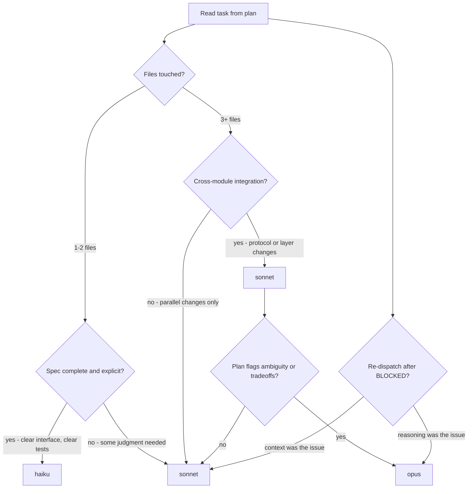

# Implementer Model Selection

The plan was authored by Opus (`/bdk:create-plan`) — that is the judgment-heavy artifact. Implementation is closer to mechanical translation. The default for the implementer subagent is **Sonnet**. The question is when to step *down* to Haiku or *up* to Opus.

The same matrix applies to the `fixer` agent — Sonnet by default, escalate when a finding requires architectural reasoning.

---

## Decision matrix

---

## Signals → model

| Signal | Model |
|---|---|
| Pure CRUD or scaffolding from a complete spec | `haiku` |
| Add a method to an existing class with explicit signature | `haiku` |
| Translate a clear data shape (DTO, schema, fixture) | `haiku` |
| Wire a new endpoint into an existing layered architecture | `sonnet` |
| Refactor preserving behavior with test cases provided | `sonnet` |
| Implement a parser, state machine, or non-trivial algorithm | `sonnet` |
| Add a new layer / module / cross-cutting concern | `opus` |
| Re-dispatch after Sonnet returned BLOCKED for reasoning reasons | `opus` |
| Plan task body says "decide between X and Y" | `opus` (or stop and report — the plan should have decided) |

---

## Why default Sonnet, not Opus

A well-formed plan from `/bdk:create-plan` lists exact files, test cases, and conventions. Opus's value over Sonnet shows up when there are open design choices — and most of those should have been resolved during planning. Spending Opus tokens to redo decisions Opus already made is wasted cost.

Reach for Opus when:

- The plan **explicitly** flags a decision deferred to implementation.
- A Sonnet attempt returned `BLOCKED` for reasoning reasons (not context reasons).
- The task touches architecture (`Impact: high` plus new layer / new public API).

## Why Haiku is rarer than it sounds

Haiku is fastest but loses fidelity on:

- Subtle style mimicry across an existing codebase.
- Multi-file edits where consistency matters.
- Tests that need realistic fixtures rather than placeholder shapes.

Use Haiku when the task is genuinely "type the obvious code." If you find yourself padding the prompt to compensate, switch to Sonnet.

---

## Cost shape (rough)

For a typical 8-task plan:

| Mix | Result |
|---|---|
| 100 % Opus implementers | Highest quality, ~6× the cost of mixed. |
| Default Sonnet, occasional Haiku, Opus on escalation | Best price/quality. **Recommended.** |
| 100 % Haiku | Brittle: drifts on style, misses cross-file consistency. |

The end-of-plan reviewers (Sonnet `code-reviewer` plus optional Opus `architecture-reviewer`) catch most of what a cheaper implementer would miss, so spending heavily on per-task models is rarely worth it.
