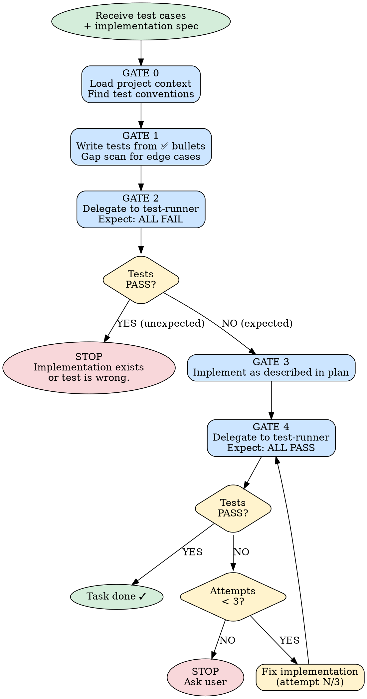

# Test-Driven Development

> Relies on BDK foundation (STARTUP_INSTRUCTIONS.md) for project context and MCP tool preference.

Rigid, gated process. Follow every gate in order. No skipping.



---

## Input

Plan task provides:

```
**Test cases:**
- ✅ Positive: given [input], expects [output]
- ❌ Negative: given [invalid input], raises [error]

**Implementation:** [what to build — file path, class, method]
```

---

## GATE 0: Load Context

Read project context:
- Test file conventions (location, naming)
- Test framework
- Existing patterns (fixtures, factories, assertions)

Tool-assisted discovery:

!`python3 ${CLAUDE_PLUGIN_ROOT}/scripts/inject.py --chain ${CLAUDE_PLUGIN_ROOT}/fragments/tool-tiers/search.chain.json`

Using the search tools above: find existing tests to avoid duplication, understand blast radius to prioritize edge cases.

Identify test file path per project conventions.

**Cannot proceed without understanding project test conventions.**

---

## GATE 1: Write Tests

**Branch on task type:**

- *Code task* (Files: lists code files): write tests per ✅ bullet using the project's test framework. Continue with the rest of this gate.
- *Doc-only task* (Files: lists only `.md` / templates / non-executable docs): write **executable assertions** instead — never accept "re-read and confirm" as a test. Use POSIX primitives:
  - `grep -q 'pattern' path` — checks content presence
  - `test -f path && test -s path` — checks file exists and non-empty
  - Save as a shell script (or single-file test that shells out) matching the project's test conventions from GATE 0. Then proceed to GATE 2 with that file as `{test_file_path}`.

Write test per ✅ bullet. Follow conventions from GATE 0.

**Before writing, scan spec for:**
- Boundary conditions (empty list, zero, first/last element)
- Invalid types or missing required fields
- Unexpected None or absent optional data

Add tests for meaningful gaps. **No padding.**

**Negative tests (❌ bullets):** Write when real value exists. Skip if no meaningful failure modes.

**Cannot proceed until every ✅ bullet has corresponding test.**

---

## GATE 2: Verify RED

Inject test command: !`python3 ${CLAUDE_PLUGIN_ROOT}/scripts/get_settings.py test-tools`

Spawn a fresh `/bdk:test-runner` agent using injected command above (fall back to detecting from project context if unavailable):

```
Run the project's test suite against: {test_file_path}
Expected: ALL written tests FAIL
```

**Record** the `agentId` from the spawn envelope into a local variable (e.g. `test_runner_agent_id`). Used by GATE 4 to avoid a redundant cold-start.

**Tests PASS:** Stop. Implementation already exists or test wrong.

**Tests FAIL as expected:** Proceed to GATE 3. ✓

---

## GATE 3: Implement

Implement per plan task. Focused on passing tests — no extra features.

---

## GATE 4: Verify GREEN

**Prefer `SendMessage` reuse over a fresh spawn:**

- If `test_runner_agent_id` was captured in GATE 2 and the cache window is likely warm (< 5 min since GATE 2): use `SendMessage(to: <test_runner_agent_id>, ...)` with the message:
  ```
  Run the project's test suite against: {test_file_path}
  Expected: ALL tests PASS
  ```
- If `test_runner_agent_id` is not available (e.g. resumed session with no warm state) OR `SendMessage` errors: fall back to a fresh `/bdk:test-runner` spawn with the same prompt. Log "verifier cache miss" to run output.

**Tests FAIL:** Fix implementation. Max 3 attempts. After 3, stop and ask user.

**Tests PASS:** Proceed. ✓

---

## Anti-Patterns

- ❌ Skipping GATE 2 ("I know it will fail")
- ❌ Writing implementation before tests exist
- ❌ Forcing negative test when no real failure mode exists
- ❌ Hardcoding test commands — always detect project's test runner
- ❌ Accepting "re-read and confirm" as a test case for a doc-only task — that's a manual step. Reject the plan task and ask `/bdk:create-plan` to rewrite with grep-able / file-presence assertions.