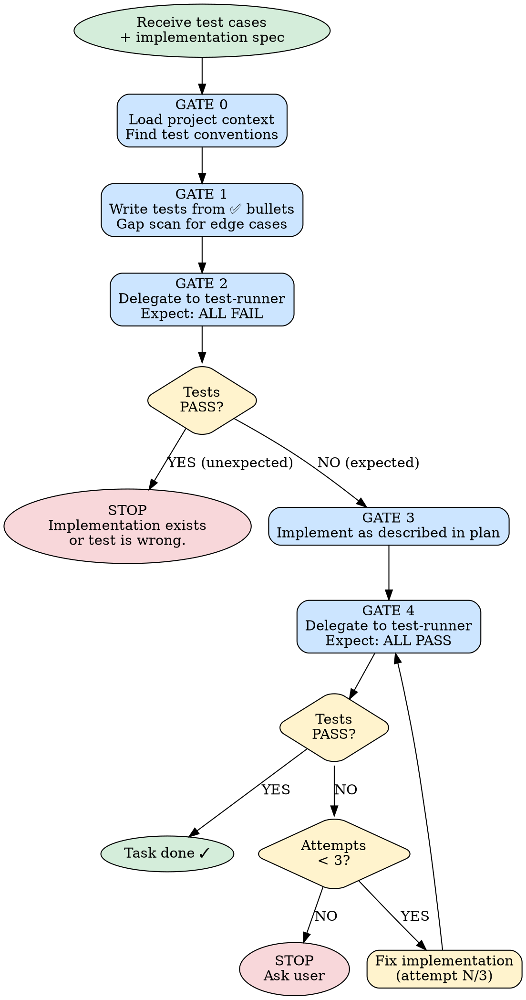

# Test-Driven Development

> Relies on BDK foundation (STARTUP_INSTRUCTIONS.md) for project context and MCP tool preference.

A rigid, gated process focused on tests. Follow every gate in order. Do not skip ahead.



---

## Input

The plan task provides:

```
**Test cases:**
- ✅ Positive: given [input], expects [output]
- ❌ Negative: given [invalid input], raises [error]

**Implementation:** [what to build — file path, class, method]
```

---

## GATE 0: Load Context

Read project context to understand:
- Test file conventions (where tests live, how they're named)
- Test framework being used
- Existing test patterns (fixtures, factories, assertions)

Identify the test file path following project conventions.

**Cannot proceed without understanding project test conventions.**

---

## GATE 1: Write Tests

Write tests for every ✅ bullet point. Follow project test conventions from GATE 0.

**Before writing, examine the implementation spec for:**
- Boundary conditions (empty list, zero, first/last element)
- Invalid types or missing required fields
- Unexpected None or absent optional data

Add test cases for meaningful gaps. **Do not add tests just to have more tests.**

**Negative tests (❌ bullets):** Write them when they provide real value. Skip if no meaningful failure modes exist.

**Cannot proceed until every ✅ bullet has a corresponding test.**

---

## GATE 2: Verify RED

Delegate to `test-runner` agent:

```
Run the project's test suite against: {test_file_path}
Expected: ALL written tests FAIL
```

**If tests PASS:** Stop. Either the implementation already exists or the test is wrong.

**If tests FAIL as expected:** Proceed to GATE 3. ✓

---

## GATE 3: Implement

Implement as described in the plan task. Keep it focused on making the tests pass — no extra features.

---

## GATE 4: Verify GREEN

Delegate to `test-runner` agent:

```
Run the project's test suite against: {test_file_path}
Expected: ALL tests PASS
```

**If tests FAIL:** Fix the implementation. Maximum 3 attempts. After 3 failures, stop and ask the user.

**If tests PASS:** Proceed. ✓

---

## Anti-Patterns

- ❌ Skipping GATE 2 ("I know it will fail")
- ❌ Writing implementation before tests exist
- ❌ Forcing a negative test when no real failure mode exists
- ❌ Hardcoding test commands — always detect the project's test runner
