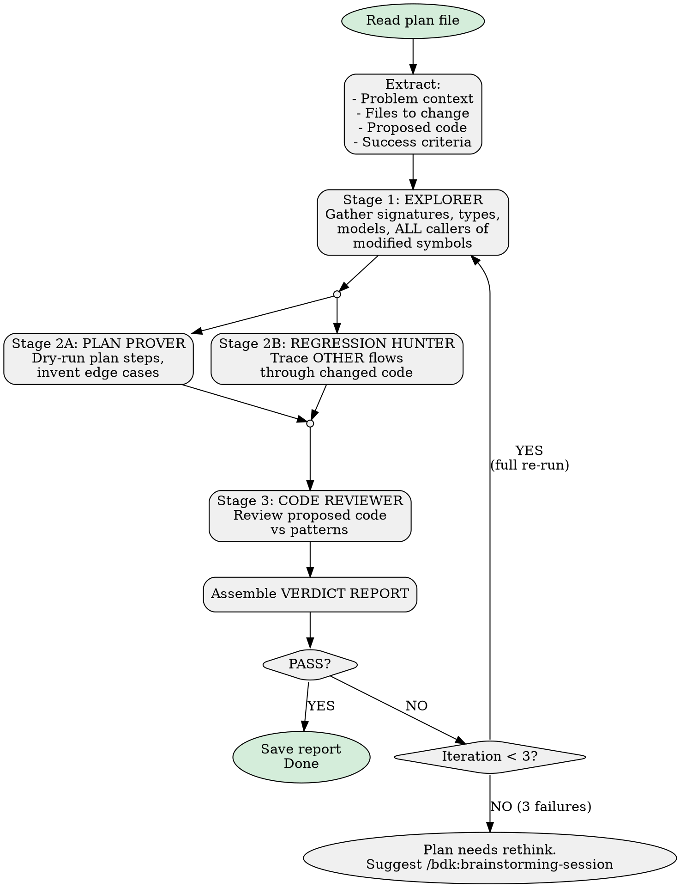

# Verify Plan

> Relies on BDK foundation (STARTUP_INSTRUCTIONS.md) for project context and MCP tool preference.

Verify plans against real code before execution.

## Invocation

```
/bdk:verify-plan docs/plans/2026-03-17-some-plan.md
```

`$ARGUMENTS` = plan file path. Read file first.

## Decision Flow



## Pipeline Execution

### Stage 1: Explorer

Launch `explorer` agent, thoroughness "very thorough":

```
Analyze the following implementation plan for verification.

PLAN:
<full plan content>

YOUR TASK:
1. For each file in "Files to change", get symbols overview
2. For each function/method the plan modifies, read its FULL current signature and body
3. For each model/class the plan references, read its fields and types
4. For ALL modified symbols, find every caller
5. List all flows that use the modified code paths

Focus on: current function signatures, parameter types, return types, model fields,
class hierarchies, callers, and downstream consumers.
```

### Stage 2A & 2B: Run in Parallel

Launch TWO `step-simulator` agents simultaneously using prompts in `references/agent-prompts.md`.

- **Stage 2A** — "Plan Prover" prompt, substitute `{plan_content}` and `{exploration_report}`
- **Stage 2B** — "Regression Hunter" prompt, substitute `{plan_content}` and `{exploration_report}`

### Stage 3: Code Reviewer

Launch `code-reviewer` agent on proposed code snippets with both simulator reports as context.

## Verdict Assembly

Merge all reports using structure in `references/verdict-template.md`. Save to `.bdk/verify-plan/<plan-name>-verification.md`.

## Loop Logic

1. PASS → save report, done
2. FAIL + iteration < 3: show remaining issues, ask to re-verify
3. FAIL + iteration >= 3: suggest `/bdk:brainstorming-session`

## Iteration Summary Format

```
## Iteration N/3 Summary

| Check            | Iter 1 | Iter 2 | Delta           |
|------------------|--------|--------|-----------------|
| Plan Proof       | 3 FAIL | 1 FAIL | Improved        |
| Regression Check | 1 WARN | 0 WARN | Fixed           |
| Code Review      | 0 FAIL | 0 FAIL | Clean           |
| **Overall**      | **FAIL**| **FAIL**| **4 → 1 issues** |
```