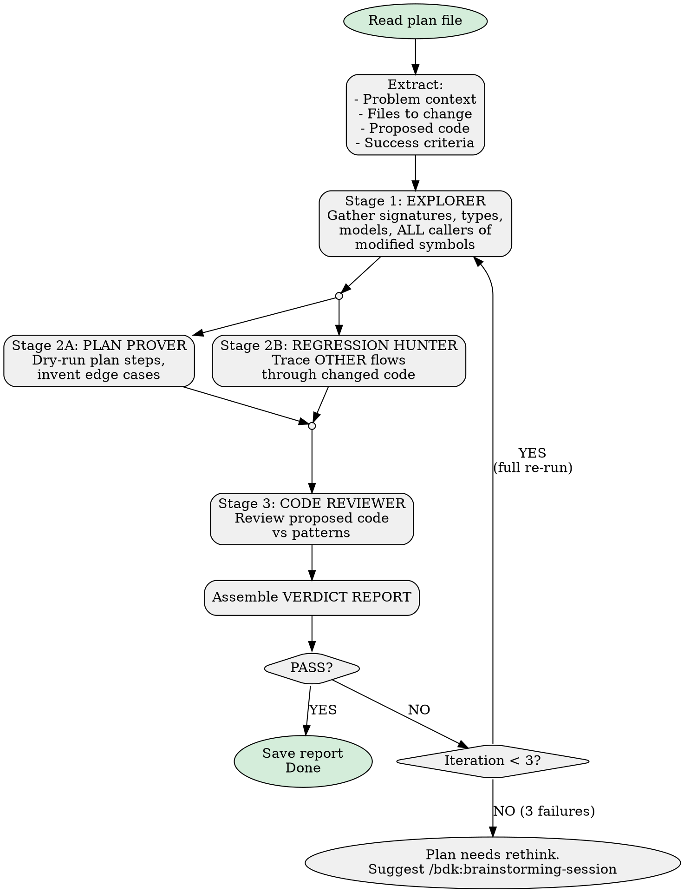

# Verify Plan

> Relies on BDK foundation (STARTUP_INSTRUCTIONS.md) for project context and MCP tool preference.

Verify implementation plans against real code before execution.

## Invocation

```
/bdk:verify-plan docs/plans/2026-03-17-some-plan.md
```

The `$ARGUMENTS` variable contains the plan file path. Read this file first.

## Decision Flow



## Pipeline Execution

### Stage 1: Explorer

Launch `explorer` agent with thoroughness "very thorough":

```
Analyze the following implementation plan for verification.

PLAN:
<full plan content>

YOUR TASK:
1. For each file in "Files to change", get symbols overview
2. For each function/method the plan modifies, read its FULL current signature and body
3. For each model/class the plan references, read its fields and types
4. For ALL modified symbols, find every caller
5. List all flows that use the modified code paths

Focus on: current function signatures, parameter types, return types, model fields,
class hierarchies, callers, and downstream consumers.
```

### Stage 2A & 2B: Run in Parallel

Launch TWO `step-simulator` agents simultaneously.

**Stage 2A — Plan Prover prompt:**
```
You are proving whether an implementation plan will work by tracing concrete data through it.

PLAN: {plan_content}
EXPLORATION REPORT: {exploration_report}

For EACH task:
1. Assumption Check: verify every referenced function/model against exploration report
2. Data Flow Trace: invent 2-3 CONCRETE examples, walk through step by step
3. Edge Case Invention: empty/null, boundaries, multi-unit, overlaps, partial data
4. Gap Analysis: where would code crash or produce wrong output?

OUTPUT FORMAT:
## Plan Proof Report
### Task N: <name>
**Verdict**: PASS / FAIL / WARNING
**Assumptions Checked**: (table)
**Data Traces**: (concrete traces)
**Edge Cases Invented**: (table)
**Issues Found**: (list)
### Overall Plan Proof Verdict: PASS / FAIL
```

**Stage 2B — Regression Hunter prompt:**
```
You are checking whether an implementation plan breaks existing flows.

PLAN: {plan_content}
EXPLORATION REPORT: {exploration_report}

1. Identify All Affected Flows from exploration report
2. Backward Compatibility Check: are new parameters optional? do existing callers need updating?
3. Flow Tracing: for each affected flow, trace through CURRENT code then CHANGED code
4. Scope Creep Detection: does the fix affect more than intended?
5. Test Coverage: are there tests that would catch regressions?

OUTPUT FORMAT:
## Regression Hunt Report
### Affected Flows Summary (table)
### Backward Compatibility (table)
### Scope Creep Findings
### Overall Regression Verdict: SAFE / REGRESSIONS FOUND / RISKS IDENTIFIED
```

### Stage 3: Code Reviewer

Launch `code-reviewer` agent on the proposed code snippets with both simulator reports as context.

## Verdict Assembly

Merge all reports into:

```markdown
# Plan Verification Report: <plan-name>

**Date**: YYYY-MM-DD
**Plan**: `<path>`
**Verdict**: PASS / FAIL / PASS WITH WARNINGS
**Iterations**: N/3

## Summary
<2-3 sentence overall assessment>

## 1. Plan Proof (Simulator A)
### Assumptions Verified (table)
### Step-by-Step Simulation

## 2. Regression Check (Simulator B)
### Affected Flows (table)
### Backward Compatibility (table)
### Scope Creep Findings

## 3. Code Review
| Severity | Finding | Location |

## 4. New Edge Cases
| # | Edge Case | Source | Why It Matters | Recommended Test |

## 5. Recommendations
### Must Fix Before Implementation
### Should Consider

## Iteration History (table)
```

## Loop Logic

1. If PASS → save report, done
2. If FAIL and iteration < 3: show remaining issues, ask to re-verify
3. If FAIL and iteration >= 3: suggest `/bdk:brainstorming-session` to rethink approach

## Iteration Summary Format

```
## Iteration N/3 Summary

| Check            | Iter 1 | Iter 2 | Delta           |
|------------------|--------|--------|-----------------|
| Plan Proof       | 3 FAIL | 1 FAIL | Improved        |
| Regression Check | 1 WARN | 0 WARN | Fixed           |
| Code Review      | 0 FAIL | 0 FAIL | Clean           |
| **Overall**      | **FAIL**| **FAIL**| **4 → 1 issues** |
```
