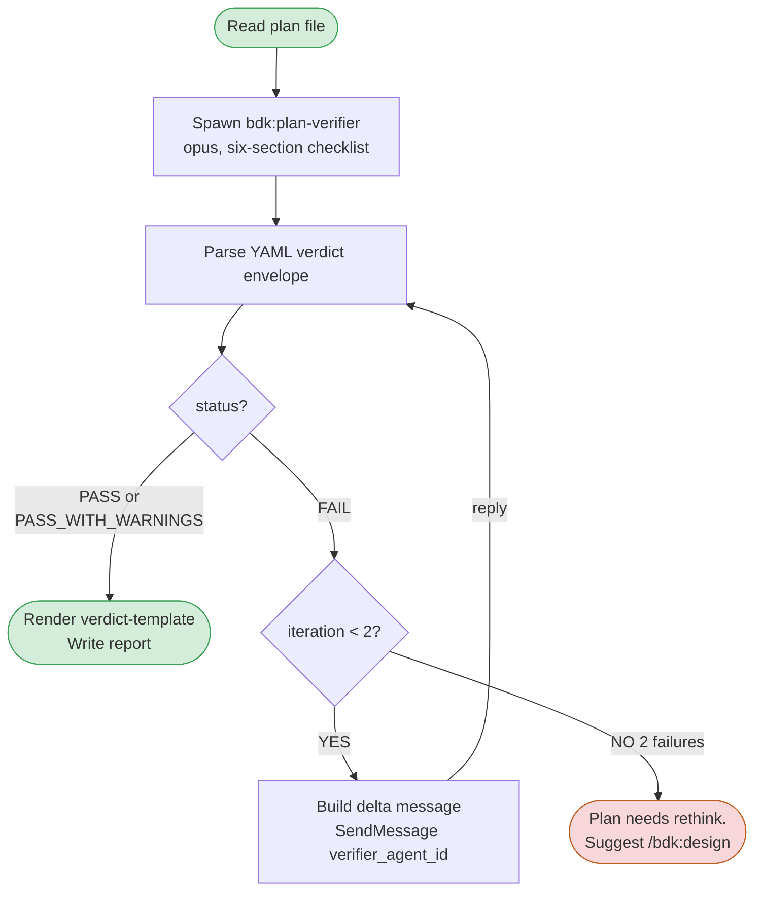

# Verify Plan

> Relies on BDK foundation (STARTUP_INSTRUCTIONS.md) for project context and MCP tool preference.

Verify plans against real code before execution. Spawns one Opus subagent (`bdk:plan-verifier`) that runs a six-section checklist and returns a YAML verdict envelope.

## Invocation

```
/bdk:verify-plan docs/plans/2026-03-17-some-plan.md
```

`$ARGUMENTS` = plan file path. Read file first.

## Decision Flow



## Step 1 — Locate Plan File

Parse `$ARGUMENTS`. Validate the path exists. Read the full content. Compute `plan-slug` = basename without `.md` extension. If the path is missing or empty, abort with a clear error and stop.

## Step 2 — Spawn `bdk:plan-verifier`

Use the Agent tool with `subagent_type: "bdk:plan-verifier"` and this message body:

```
PLAN FILE: <path>
ITERATION: 1
FULL PLAN CONTENT:
---
<plan content verbatim>
---
For each task, run all six checklist sections (signature_drift, data_trace,
edge_cases, regression_flows, test_coverage, plan_completeness). Emit the
YAML verdict envelope as the LAST block of your reply — no prose after it.
```

Capture `agent_id` from the spawn envelope. Store as `verifier_agent_id` — needed for iteration 2 SendMessage.

## Step 3 — Parse YAML Envelope

Extract the final ```yaml ... ``` block from the agent's reply. Parse it. Required keys: `status`, `iteration`, `per_task`, `must_fix`.

Malformed YAML handling: respawn the agent once with the identical message. If the second reply is also malformed, abort and report the parse error to the user — do not silently continue.

## Step 4 — Decide Next Action

Branch on `status`:

| `status` | Action |
|---|---|
| `PASS` or `PASS_WITH_WARNINGS` | Go to Step 5 (write report). |
| `FAIL` and `iteration < 2` | Build a delta message (below). Call `SendMessage(to: verifier_agent_id, message: <delta>)`. Loop back to Step 3 with the new reply. |
| `FAIL` and `iteration == 2` | Stop. Print a concise summary of remaining `must_fix` entries. Recommend `/bdk:design` — after two failed iterations the plan is structurally wrong, not detail-wrong. |

**Delta message template (iteration 2):**

```
Iteration 2.
Task IDs to re-verify: <deduped task_ids from must_fix>
Other tasks are unchanged — carry forward iteration-1 verdicts.
Run all six checklist sections only on the listed tasks. Emit the YAML
verdict envelope as the LAST block, with iteration: 2.
```

## Step 5 — Write Verification Report

Render the report using `references/verdict-template.md`. Save to:

```
.bdk/verify-plan/<plan-slug>-verification.md
```

Confirm in chat with the report path and the pass/fail summary line.

## Notes

- Loop cap = 2 iterations. Third would be wasted work; escalation is the intended path.
- The agent retains plan content + iteration-1 findings across SendMessage. Pass only the delta — do not re-include the full plan.
- See STARTUP "Continuing a Spawned Agent" for the 5-min warm-cache window. If iteration 2 is delayed beyond that, the SendMessage still works but pays a cache miss.
